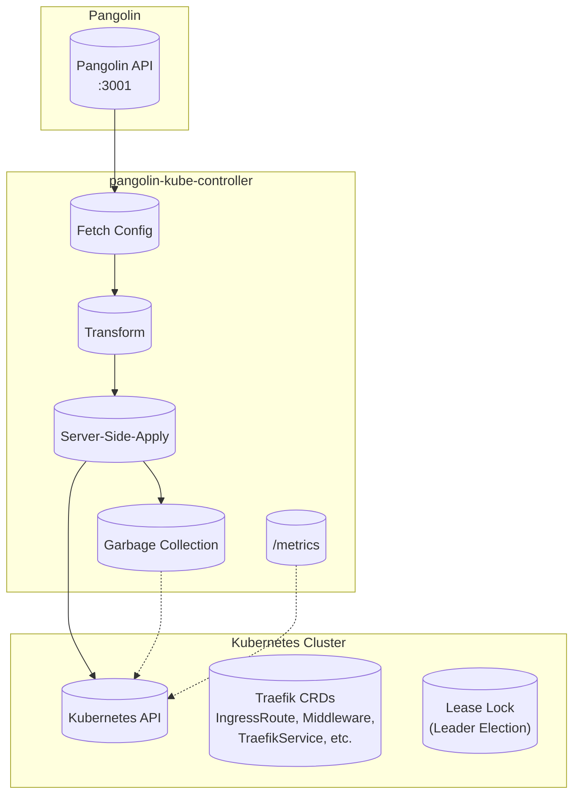

# Pangolin Kubernetes Controller

[](https://github.com/fosrl/pangolin-kube-controller/actions/workflows/ci.yml)
[](https://github.com/fosrl/pangolin-kube-controller/actions/workflows/continuous-security.yml)
[](https://securityscorecards.dev/viewer/?uri=github.com/fosrl/pangolin-kube-controller)
[](https://www.bestpractices.dev/projects/11206)
[](https://goreportcard.com/report/github.com/fosrl/pangolin-kube-controller)
[](https://github.com/fosrl/pangolin-kube-controller/releases/latest)

[](https://artifacthub.io/packages/search?org=fosrl)
[](https://hub.docker.com/r/fosrl/pangolin-kube-controller)

[](https://www.repostatus.org/#active)

## Overview

The Pangolin Kubernetes Controller synchronizes Traefik dynamic configuration from [Pangolin](https://github.com/fosrl/pangolin) into Kubernetes native resources. It polls Pangolin for the desired state, performs safe updates using Server-Side-Apply, and exposes operational metrics for observability.

Part of the [Pangolin](https://github.com/fosrl/pangolin) ecosystem - an open-source, identity-aware VPN and proxy platform.

## Architecture



## Features

- **Server-Side-Apply**: Safe, collaborative resource updates using Kubernetes Server-Side-Apply
- **Leader Election**: High-availability deployments with Kubernetes Lease-based leader election
- **Garbage Collection**: Automatic cleanup of orphaned Traefik resources
- **TLS/mTLS Support**: Secure communication with Pangolin API including certificate-based auth
- **Observability**: Prometheus metrics and OpenTelemetry support for monitoring
- **Health Probes**: Liveness and readiness endpoints for Kubernetes integration
- **Read-Only Mode**: Optional non-mutating mode for validation and inspection

## Prerequisites

- Kubernetes cluster 1.29+
- A running [Pangolin](https://github.com/fosrl/pangolin) instance
- Helm 3.x (for installation) or Kustomize

## Installation

### Helm (Recommended)

```bash
# Add Fossorial Helm repository
helm repo add fossorial https://charts.fossorial.io
helm repo update fossorial

# Install the controller
helm install pangolin fossorial/pangolin
```

For configuration options, see the [controller documentation](docs/controller/controller.md).

### Container Images

Pre-built images are available:

- Docker Hub: [`fosrl/pangolin-kube-controller`](https://hub.docker.com/r/fosrl/pangolin-kube-controller)
- GitHub Container Registry: [`ghcr.io/fosrl/pangolin-kube-controller`](https://github.com/fosrl/pangolin-kube-controller/pkgs/container/pangolin-kube-controller)

## Configuration

Configuration is provided via environment variables:

| Flag / Environment Variable | Default | Description |
| --- | --- | --- |
| `METRICS_ADDR` | `:9090` | Address for the health/metrics server |
| `CONFIG_ENDPOINT` | `https://pangolin:3001/api/v1/traefik-config` | Pangolin API endpoint |
| `TARGET_NAMESPACE` | `pangolin` | Namespace where Traefik resources live |
| `ENABLE_LEADER_ELECTION` | `false` | Enable Kubernetes Lease-based leader election |
| `LEASE_LOCK_NAMESPACE` | `$TARGET_NAMESPACE` | Namespace for the leader election Lease |
| `READ_ONLY` | `false` | Disable mutating operations when set |
| `LOG_TRAEFIK_CONFIG` | `false` | DEBUG ONLY. Do not enable in production |
| `CONFIG_TLS_SKIP_VERIFY` | `false` | SECURITY: disable TLS verification for Pangolin fetch |

See [controller documentation](docs/controller/controller.md) for a complete configuration reference.

## Metrics & Probes

### Health Endpoints

- `GET /healthz` – returns `200 OK` when the process is running
- `GET /readyz` – returns `200 OK` when the controller is connected to Kubernetes and holds the leader lease (if enabled)
- `GET /metrics` – Prometheus metrics endpoint

### Prometheus Metrics

- `pangolin_controller_reconcile_seconds` – duration of full reconcile loops
- `pangolin_controller_reconcile_errors_total` – count of reconcile errors
- `pangolin_controller_objects_applied_total` – objects applied by kind and action
- `pangolin_controller_objects_deleted_total` – objects deleted by kind
- `pangolin_controller_ready` – readiness state (1 ready, 0 not ready)
- `pangolin_controller_last_fetch_success_timestamp_seconds` – timestamp of the last successful fetch

## Documentation

- [Controller Documentation](docs/controller/controller.md) – Architecture, configuration, and reconciliation flow
- [Pangolin Docs](https://docs.pangolin.net/) – Full Pangolin platform documentation

## Contributing

Contributions are welcome! See [CONTRIBUTING](CONTRIBUTING.md) for workflow and branch protection information.

### Development Setup

```bash
# Install dependencies
go mod download

# Run validation (lint, fmt, vet, test)
task ci

# Build the controller
task build
```

For architectural overview and reconciliation flow diagrams, see [controller documentation](docs/controller/controller.md).

## Community

For support, discussions, and contributions to the broader Pangolin ecosystem:

- [Pangolin GitHub](https://github.com/fosrl/pangolin) – Main Pangolin project
- [Pangolin Discord](https://discord.gg/HCJR8Xhme4) – Community chat
- [Pangolin Slack](https://pangolin.net/slack) – Alternative community channel

## Security

For security issues, please review our [SECURITY](SECURITY.md) policy.

## License

[License](LICENSE) – See project license for terms.
