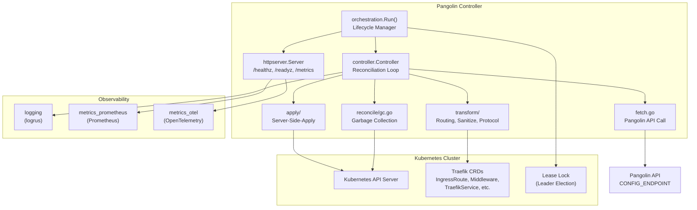
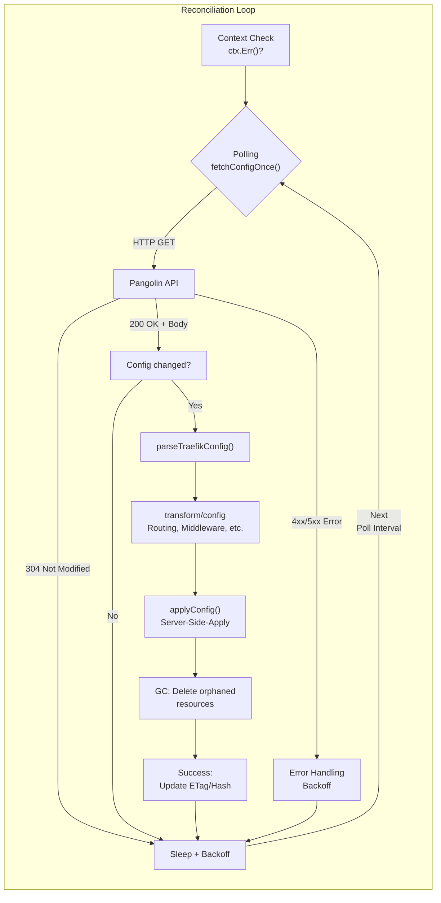
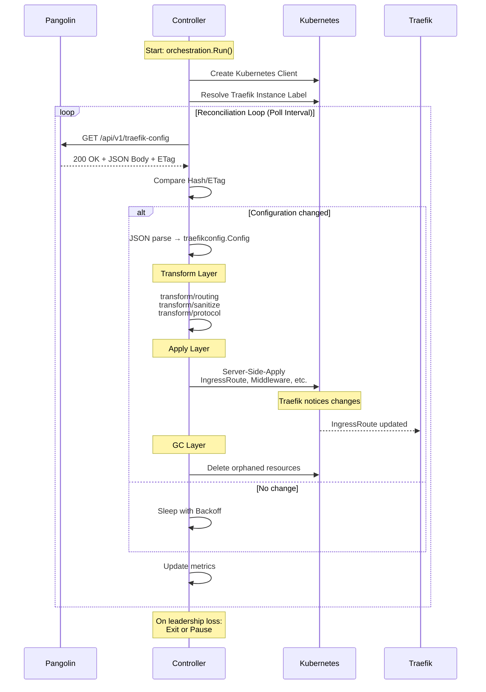
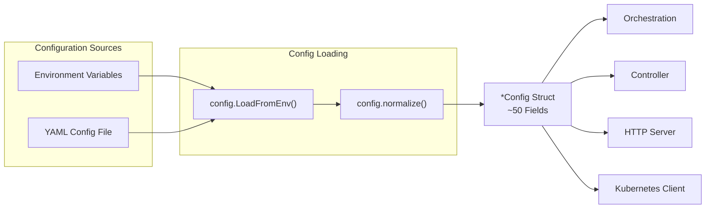
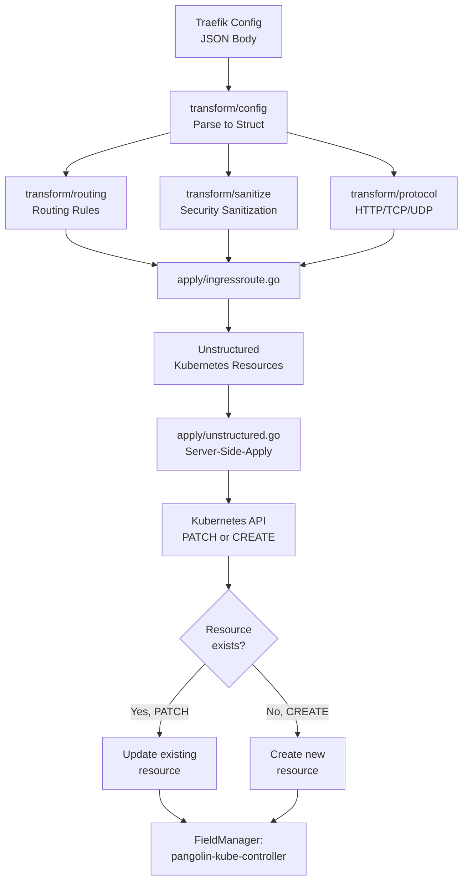
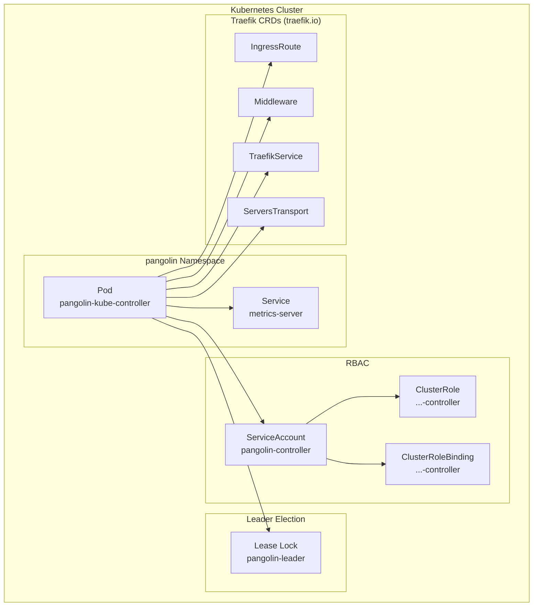
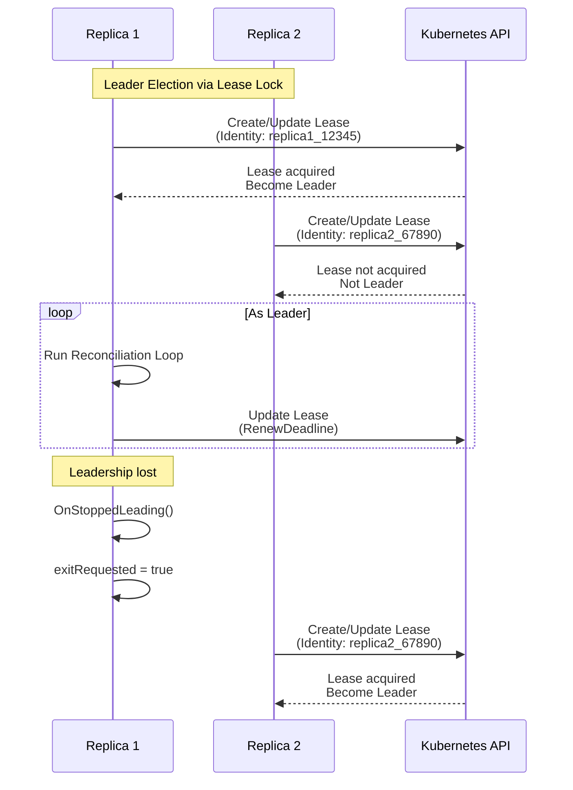
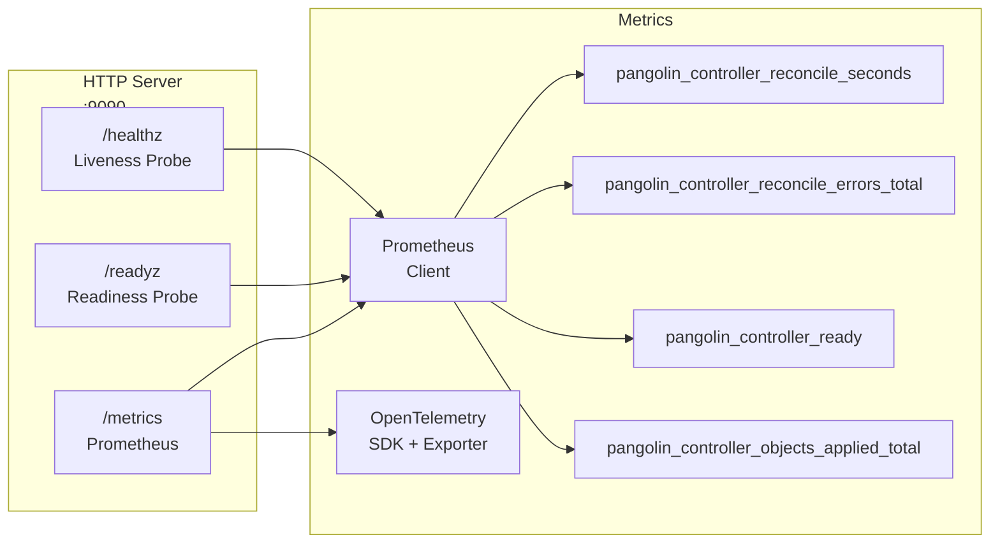

<!-- markdownlint-disable MD024 MD025 MD036 MD060 -->
# Pangolin Kubernetes Controller – Complete Repository Documentation

---

# 1. Executive Summary

## What the Project Is About

**Pangolin Kubernetes Controller** is a Kubernetes Operator (Custom Controller) that fetches Traefik Dynamic Configuration from an external service called "Pangolin" and translates it into Kubernetes resources. It acts as a **Bridge** between an external configuration system (Pangolin) and the Kubernetes ecosystem (Traefik CRDs).

## Main Purpose of the System

The controller:

1. **Polls** a REST endpoint (`CONFIG_ENDPOINT`) regularly for Traefik configuration
2. **Transforms** the received configuration into Kubernetes-native Traefik CRDs (IngressRoute, Middleware, TraefikService, etc.)
3. **Applies** these resources to the Kubernetes API server using Server-Side-Apply
4. **Reconciles** continuously the desired state (Pangolin) with the actual state (Kubernetes)
5. **Garbage-Collects** orphaned resources that are no longer present in the Pangolin configuration
6. **Exports** Prometheus/OpenTelemetry metrics for observability
7. **Supports** Leader Election for high-availability deployments

## Technology Stack

| Category | Technology |
|-----------|-------------|
| **Language** | Go 1.26.1 |
| **Kubernetes Client** | `k8s.io/client-go` v0.35.3, `sigs.k8s.io/controller-runtime` v0.23.3 |
| **CRDs** | Traefik.io v1alpha1 (IngressRoute, Middleware, TraefikService, ServersTransport, IngressRouteTCP/UDP, ServersTransportTCP) |
| **Configuration** | Environment variables + optional ConfigFile |
| **Logging** | `sirupsen/logrus` v1.9.4 |
| **Metrics** | Prometheus Client (`prometheus/client_golang`), OpenTelemetry SDK |
| **HTTP** | Standard library `net/http` |
| **Serialization** | JSON |

## Release/Deployment Model

- **Release**: GitHub Releases via `release.yml` workflow
- **Container Registry**: GitHub Container Registry (`ghcr.io`)
- **Versioning**: Semantic versioning (Tags)

## Test and Quality Strategy

- **Unit Tests**: Go standard tests alongside packages (`*_test.go`)
- **Integration Tests**: `test/integration/` with `envtest` (Kubernetes API test framework)
- **E2E Tests**: `test/e2e/` (offline tests)
- **CI/CD**: GitHub Actions (`ci.yml`, `build-publish.yml`, `release.yml`)
- **Linting**: `golangci-lint`, `hadolint`, `yamllint`, `markdownlint`, `shfmt (-d -s)`
- **Security**: CodeQL, Trivy, DeepSource, Semgrep, Gosec
- **Coverage**: Coverprofiles (atomic mode), minimum threshold 75%

## Security/Compliance Character

- **TLS Verify Flag** for Pangolin API (`CONFIG_TLS_SKIP_VERIFY`)
- **mTLS Support** via CAFile, ClientCertFile, ClientKeyFile
- **ReadOnly Mode** for non-mutating operations
- **Leader Election** with Kubernetes Lease Locks
- **Security Policy**: `SECURITY.md`
- **OpenSSF Best Practices Badge** pursued

## Brief Architecture Assessment

The controller follows the **Operator Pattern** with a clear layered architecture:

- `cmd/` → Entry points
- `internal/orchestration/` → Lifecycle orchestration
- `internal/controller/` → Reconciliation loop
- `internal/transform/` → Configuration transformation
- `internal/apply/` → Server-Side-Apply
- `internal/kube/` → Kubernetes client abstraction
- `internal/httpserver/` → HTTP server for metrics/health
- `internal/observability/` → Logging, Metrics, Tracing

---

# 2. Architecture Overview

## Entry Points

### `cmd/controller/main.go`

The **primary entry point** for the main controller. Starts orchestration with:

- Signal handler for SIGTERM/SIGINT
- Configuration from environment variables
- Version logging

### `cmd/healthcheck/main.go`

**Secondary entry point** for a dedicated health-check process (or test harness).

## Core Modules

| Package | Responsibility |
|-------|--------------|
| `internal/orchestration` | Lifecycle management: HTTP server, Leader Election, Label Monitoring, graceful Shutdown |
| `internal/controller` | Reconciliation loop: Polling, Fetch, Parse, Apply, Change Detection, Backoff, Garbage Collection |
| `internal/transform` | Traefik config transformation: Routing, Sanitizing, Protocol adaptation |
| `internal/apply` | Server-Side-Apply for Kubernetes resources |
| `internal/kube` | Kubernetes client factory, label resolution |
| `internal/config` | Configuration loading from env/files |
| `internal/httpserver` | HTTP server (Metrics, Health probes) |
| `internal/observability` | Logging, Prometheus metrics, OpenTelemetry metrics |

## Package Structure

```text
cmd/
├── controller/          # Main controller
│   ├── main.go
│   ├── main_test.go
│   └── doc.go
└── healthcheck/         # Healthcheck harness
    ├── main.go
    ├── main_test.go
    └── doc.go

internal/
├── orchestration/       # Run orchestration
├── controller/          # Core controller logic
│   ├── loop.go          # Reconciliation polling loop
│   ├── apply.go         # Config application
│   ├── fetch.go         # Pangolin API call
│   ├── reconcile/       # Reconciliation + GC
│   └── ...
├── config/              # Configuration management
├── transform/           # Traefik config transformation
│   ├── config/          # Traefik data models
│   ├── protocol/        # HTTP/TCP/UDP protocol logic
│   ├── routing/         # Routing rules
│   └── sanitize/         # Input sanitization
├── apply/               # Server-Side-Apply
├── kube/                # Kubernetes client
│   ├── labels/          # Label resolution
│   └── resources/       # Resource adapter
├── httpserver/          # HTTP server
│   ├── server.go
│   ├── routes.go
│   └── tls.go
├── observability/        # Observability
│   ├── logging/
│   ├── metrics_prometheus/
│   └── metrics_otel/
├── testschema/          # CRD test helpers
├── testutil/            # Test tools
└── version/             # Build version
```

## Typical Data Flows

```text
Pangolin-API (HTTP)
        │
        ▼
┌───────────────────┐
│  fetch.go         │ ← ETag/If-None-Match, Conditional Fetch
└────────┬──────────┘
         ▼
┌───────────────────┐
│  parseTraefikConfig│ → traefikconfig.Config
└────────┬──────────┘
         ▼
┌───────────────────┐
│  transform/config │ ← Routing, Middleware, Services
│  transform/routing│
│  transform/sanitize│
└────────┬──────────┘
         ▼
┌───────────────────┐
│  apply.go         │ ← Server-Side-Apply
└────────┬──────────┘
         ▼
┌───────────────────┐
│  Kubernetes API   │ ← IngressRoute, Middleware, etc.
└───────────────────┘
```

## Difference Between Top-Level Directories

| Directory | Type | Purpose |
|------------|-----|-------|
| `cmd/` | **Production Code** | Entry points (main packages) |
| `internal/` | **Production Code** | Core logic, no external imports expected |
| `test/` | **Test Code** | Integration tests, E2E tests, test fixtures |
| `docs/` | **Documentation** | User and developer documentation |
| `hack/` | **Build/Release Tools** | Taskfiles, scripts, helper programs |
| `.github/` | **CI/CD** | GitHub Actions workflows, templates |

## Which Parts Affect Production and Which Only Development Process

| Category | Paths |
|-----------|-------|
| **Production Runtime** | `cmd/controller/main.go`, `internal/` (without `test*`) |
| **Build & Release** | `Taskfile.yml`, `Dockerfile`, `hack/scripts/`, `hack/taskfiles/` |
| **Test** | `*_test.go` files, `test/integration/`, `test/e2e/`, `internal/testschema/`, `internal/testutil/` |
| **CI/CD** | `.github/workflows/`, `.github/actions/` |
| **Documentation** | `docs/`, `README.md`, `CONTRIBUTING.md`, `AGENTS.md` |
| **Tooling/Configuration** | `.golangci.yml`, `.yamllint.yaml`, `.deepsource.toml`, etc. |

---

# 3. Detailed Project Description with Architecture Diagrams

## Overview

The **Pangolin Kubernetes Controller** is a Kubernetes operator that acts as a bridge between the Pangolin configuration service and Traefik CRDs. It implements a typical **Reconciliation Loop** as common in Kubernetes controllers.

## Main Components and Their Interaction



## Reconciliation Loop (Main Loop)

The controller implements an **event-driven polling loop** that fetches the configuration from Pangolin at regular intervals:



## Data Flow (Detail)



## Configuration Flow



## Server-Side-Apply Flow



## Deployment Architecture



## High-Availability Mode (Leader Election)



## HTTP Server and Observability



---

# 4. Top-Level Inventory

## `.deepsource.toml`

**Type**: Configuration file (Tooling)  
**Purpose**: DeepSource code analysis configuration  
**Significance**: Static code analysis and technical debt tracking  
**Category**: Quality Assurance / Security  

## `.dockerignore`

**Type**: Docker build configuration  
**Purpose**: Exclude files/directories from Docker build context  
**Significance**: Reduces Docker image size and build time  
**Category**: Build  

## `.editorconfig`

**Type**: Editor configuration  
**Purpose**: Consistent coding styles across editors  
**Significance**: Consistency in line endings, indentation, character sets  
**Category**: Tooling  

## `.env` / `.env.example`

**Type**: Environment variables  
**Purpose**: Local development configuration (`.env`) and template (`.env.example`)  
**Significance**: Contains **local development settings**, not for production  
**Category**: Config / Local  
**Note**: `.env` likely contains real secrets for local development

## `.gitattributes`

**Type**: Git configuration  
**Purpose**: Git attributes for files (e.g., line ending normalization)  
**Significance**: Consistency across operating systems  
**Category**: VCS  

## `.github/`

**Type**: Directory  
**Purpose**: GitHub-specific files (workflows, actions, templates)  
**Significance**: CI/CD, issue/PR templates, security scanning  
**Category**: CI/CD  

## `.gitignore`

**Type**: Git configuration  
**Purpose**: Exclude files/directories from Git tracking  
**Significance**: Prevents accidental committing of build artifacts, secrets, etc.  
**Category**: VCS  

## `.golangci.yml`

**Type**: Linter configuration  
**Purpose**: golangci-lint configuration (linting rules)  
**Significance**: Enforce code quality standards  
**Category**: Quality Assurance  

## `.hadolint.yaml`

**Type**: Linter configuration  
**Purpose**: Hadolint configuration for Dockerfile analysis  
**Significance**: Docker best practices  
**Category**: Quality Assurance  

## `.markdownlint-cli2.yaml`

**Type**: Linter configuration  
**Purpose**: Markdown linting configuration  
**Significance**: Documentation quality  
**Category**: Quality Assurance  

## `.semgrep.yml`

**Type**: Security scanner configuration  
**Purpose**: Semgrep rules for static security analysis  
**Significance**: Security auditing  
**Category**: Security  

## `.sonarlint/`

**Type**: Directory  
**Purpose**: SonarLint configuration for IDE integration  
**Significance**: Local code analysis  
**Category**: Tooling  

## `.task/`

**Type**: Directory  
**Purpose**: Likely cache/state for the `task` task runner  
**Significance**: Not relevant for version control  
**Category**: Local/Artifact  

## `.trivyignore`

**Type**: Security configuration  
**Purpose**: Trivy container scanner ignore certain findings  
**Significance**: Reduces noise in security scans  
**Category**: Security  

## `.vscode/`

**Type**: Directory  
**Purpose**: VSCode workspace configuration  
**Significance**: Editor-specific settings for contributors  
**Category**: Editor  

## `.yamllint.yaml`

**Type**: Linter configuration  
**Purpose**: YAML validation for Kubernetes manifests and CI configuration  
**Significance**: YAML quality  
**Category**: Quality Assurance  

## `AGENTS.md`

**Type**: Documentation  
**Purpose**: Instructions for AI agents (like me) that work on this repository  
**Significance**: Defines workflow standards, coding conventions, quick start commands  
**Category**: Contributor documentation  

## `CHANGELOG.md`

**Type**: Documentation  
**Purpose**: History of releases and changes  
**Significance**: Release notes for users  
**Category**: Release documentation  

## `CODE_OF_CONDUCT.md`

**Type**: Documentation  
**Purpose**: Code of conduct for contributors  
**Significance**: Community standards  
**Category**: Community  

## `CONTRIBUTING.md`

**Type**: Documentation  
**Purpose**: Contribution guidelines and workflow information  
**Significance**: Onboarding for new contributors  
**Category**: Contributor documentation  

## `Dockerfile`

**Type**: Docker build configuration  
**Purpose**: Multi-stage build for the main container image  
**Significance**: Production release image  
**Category**: Build / Release  

## `Dockerfile.scratch`

**Type**: Docker build configuration  
**Purpose**: Minimal image without operating system (scratch base)  
**Significance**: Maximum reduction of attack surface  
**Category**: Build / Release  

## `LICENSE`

**Type**: Documentation (Legal)  
**Purpose**: Open source license (likely MIT or Apache 2.0)  
**Significance**: Legal terms of use  
**Category**: Legal  

## `MAINTAINERS.md`

**Type**: Documentation  
**Purpose**: Information about project maintainers  
**Significance**: Responsibilities and contacts  
**Category**: Governance  

## `README.md`

**Type**: Documentation  
**Purpose**: Main documentation for users and newcomers  
**Significance**: Overview, quickstart, configuration, metrics  
**Category**: User documentation  

## `SECURITY.md`

**Type**: Documentation  
**Purpose**: Security policy and vulnerability reporting  
**Significance**: Security compliance  
**Category**: Security  

## `SUPPORT.md`

**Type**: Documentation  
**Purpose**: Support channels and resources  
**Significance**: Help for users  
**Category**: User documentation  

## `Taskfile.yml`

**Type**: Build configuration  
**Purpose**: Task task runner configuration (alternative to Make)  
**Significance**: Standardized build, test, release tasks  
**Category**: Build  

## `VERSION`

**Type**: Artifact  
**Purpose**: Contains the current version number (e.g., `0.1.0-alpha.1`)
**Significance**: Read during build via `-ldflags`  
**Category**: Build artifact  

## `commitlint.config.mjs`

**Type**: CI configuration  
**Purpose**: Commit message format validation (Conventional Commits)  
**Significance**: Consistent commit history  
**Category**: CI/CD  

## `docs/`

**Type**: Directory  
**Purpose**: Extensive documentation (build, releases, controller, CI/CD, archives)  
**Significance**: Deep technical documentation  
**Category**: Documentation  

## `go.mod` / `go.sum`

**Type**: Go module configuration  
**Purpose**: Dependency management  
**Significance**: Build reproducibility  
**Category**: Build  

## `hack/`

**Type**: Directory  
**Purpose**: Helper scripts and taskfiles for build/release processes  
**Significance**: CI/CD support  
**Category**: Tooling  

## `internal/`

**Type**: Directory  
**Purpose**: Private packages with core logic. Not intended for external imports.  
**Significance**: Main codebase  
**Category**: Production code  

## `renovate.json`

**Type**: Configuration file  
**Purpose**: Renovate bot configuration for automated dependency updates  
**Significance**: Keep dependencies up to date  
**Category**: CI/CD / Security  

## `sonar-project.properties`

**Type**: Tooling configuration  
**Purpose**: SonarQube/scanner configuration  
**Significance**: Code quality analysis  
**Category**: Quality Assurance  

## `test/`

**Type**: Directory  
**Purpose**: Integration tests and E2E tests  
**Significance**: Test infrastructure  
**Category**: Test  

## `unit.out`

**Type**: Artifact  
**Purpose**: Coverage profiles from unit tests  
**Significance**: Local test artifact  
**Category**: Test artifact  
**Note**: Should be in `.gitignore`  

---

# 5. Detailed Directory and File Description

## `cmd/`

### Purpose

Entry points for executable programs (Go main packages).

### Category

**Production Code / Runtime**

---

### `cmd/controller/`

**Main controller application**.

#### `cmd/controller/main.go`

- **Category**: Code (Production)
- **Purpose**: Primary entry point. Initializes logging, loads configuration, starts `orchestration.Run()`
- **User group**: Ops/Production
- **Criticality**: High
- **Status**: Active

#### `cmd/controller/main_test.go`

- **Category**: Test
- **Purpose**: Integration test of main function (exit codes, error cases)
- **User group**: Developers
- **Criticality**: Medium
- **Status**: Active

#### `cmd/controller/doc.go`

- **Category**: Documentation (Go-Doc)
- **Purpose**: Package documentation
- **User group**: Developers
- **Criticality**: Low
- **Status**: Active

---

### `cmd/healthcheck/`

**Dedicated health check process** (likely for Kubernetes liveness/readiness probes or test harness).

#### `cmd/healthcheck/main.go`

- **Category**: Code (Production)
- **Purpose**: Healthcheck harness
- **User group**: Ops/Production
- **Criticality**: Medium
- **Status**: Active

#### `cmd/healthcheck/main_test.go`

- **Category**: Test
- **Purpose**: Tests for healthcheck
- **User group**: Developers
- **Criticality**: Low
- **Status**: Active

#### `cmd/healthcheck/doc.go`

- **Category**: Documentation (Go-Doc)
- **Purpose**: Package documentation
- **User group**: Developers
- **Criticality**: Low
- **Status**: Active

---

## `internal/`

### Purpose

Private packages with core logic. Not intended for external imports.

### Category

**Production Code / Core Logic**

---

### `internal/orchestration/`

**Lifecycle orchestration**: Starts HTTP server, Leader Election, Label Monitoring and coordinates graceful Shutdown.

#### `internal/orchestration/run.go`

- **Category**: Code (Production)
- **Purpose**: Central orchestration - builds Kubernetes clients, starts HTTP server, Leader Election loop, Label Monitoring in parallel, coordinates Shutdown
- **User group**: Ops/Production
- **Criticality**: High
- **Status**: Active
- **Relationships**:
  - `cmd/controller/main.go` → `orchestration.Run()`
  - Depends on `kube.NewClients`, `labels.ResolveInstanceLabel`, `controller.NewController`
  - Starts `inthttp.Server`, `leaderelection.RunOrDie`

#### `internal/orchestration/run_test.go`

- **Category**: Test
- **Purpose**: Unit tests for orchestration logic (HTTP server start, shutdown, graceful shutdown)
- **User group**: Developers
- **Criticality**: Medium
- **Status**: Active

---

### `internal/controller/`

**Core controller logic**: Reconciliation loop, Fetch, Apply, Change Detection, Backoff, Leader Election, Readiness, Garbage Collection.

#### `internal/controller/controller.go`

- **Category**: Code (Production)
- **Purpose**: Main controller structure with GVR (GroupVersionResource) definitions for Traefik CRDs, HTTP client configuration, Graceful Deletion Queue, Leader Election Identity
- **User group**: Ops/Production
- **Criticality**: High
- **Status**: Active
- **Tracked CRDs**: IngressRoute, Middleware, TraefikService, ServersTransport, IngressRouteTCP, IngressRouteUDP, ServersTransportTCP

#### `internal/controller/loop.go`

- **Category**: Code (Production)
- **Purpose**: Main polling loop: Fetch → Parse → Apply → Sleep with backoff. ETag/If-None-Match, hash-based change detection
- **User group**: Ops/Production
- **Criticality**: High
- **Status**: Active
- **Relationships**: `fetchConfigOnce()`, `parseTraefikConfig()`, `applyConfig()`

#### `internal/controller/fetch.go`

- **Category**: Code (Production)
- **Purpose**: HTTP fetch from Pangolin API with timeout, auth header, TLS skip verify, conditional request (ETag)
- **User group**: Ops/Production
- **Criticality**: High
- **Status**: Active

#### `internal/controller/apply.go`

- **Category**: Code (Production)
- **Purpose**: Server-Side-Apply of transformed Traefik configuration to Kubernetes. Handles upsert/delete per CRD type
- **User group**: Ops/Production
- **Criticality**: High
- **Status**: Active
- **Relationships**: `internal/apply/`, `reconcile/gc.go`

#### `internal/controller/change_detection.go`

- **Category**: Code (Production)
- **Purpose**: Determines if configuration has changed (hash comparison, ETag comparison)
- **User group**: Ops/Production
- **Criticality**: High
- **Status**: Active

#### `internal/controller/backoff.go`

- **Category**: Code (Production)
- **Purpose**: Exponential backoff on errors (prevents crash loops)
- **User group**: Ops/Production
- **Criticality**: Medium
- **Status**: Active

#### `internal/controller/leader_election.go`

- **Category**: Code (Production)
- **Purpose**: Kubernetes Lease-based Leader Election. Only one controller replica active at any time
- **User group**: Ops/Production
- **Criticality**: High
- **Status**: Active

#### `internal/controller/readiness.go`

- **Category**: Code (Production)
- **Purpose**: Readiness probe logic (Kubernetes client connection, leader lease)
- **User group**: Ops/Production
- **Criticality**: Medium
- **Status**: Active

#### `internal/controller/doc.go`

- **Category**: Documentation
- **Purpose**: Package documentation
- **User group**: Developers
- **Criticality**: Low
- **Status**: Active

**Test files** (all category: Test, user group: Developers, criticality: Medium):

- `apply_extra_test.go`, `apply_test.go`
- `backoff_extra_test.go`, `backoff_test.go`
- `change_detection_test.go`
- `controller_test.go`
- `fetch_extra_test.go`, `fetch_test.go`
- `leader_election_extra_test.go`, `leader_election_test.go`
- `loop_extra_test.go`, `loop_test.go`
- `readiness_test.go`

---

### `internal/reconcile/`

**Reconciliation-specific logic and Garbage Collection**.

#### `internal/reconcile/gc.go`

- **Category**: Code (Production)
- **Purpose**: Garbage Collection: Deletes Traefik resources that are no longer in the Pangolin configuration
- **User group**: Ops/Production
- **Criticality**: High
- **Status**: Active

#### `internal/reconcile/doc.go`

- **Category**: Documentation
- **Purpose**: Package documentation
- **User group**: Developers
- **Criticality**: Low
- **Status**: Active

#### `internal/reconcile/gc_test.go`

- **Category**: Test
- **Purpose**: GC tests
- **User group**: Developers
- **Criticality**: Medium
- **Status**: Active

---

### `internal/apply/`

**Server-Side-Apply layer**: Transforms Traefik config into Kubernetes resources and applies them.

#### `internal/apply/endpointslice.go`

- **Category**: Code (Production)
- **Purpose**: EndpointSlice resource apply
- **User group**: Ops/Production
- **Criticality**: Medium
- **Status**: Active

#### `internal/apply/ingressroute.go`

- **Category**: Code (Production)
- **Purpose**: IngressRoute CRDs apply
- **User group**: Ops/Production
- **Criticality**: High
- **Status**: Active

#### `internal/apply/metadata.go`

- **Category**: Code (Production)
- **Purpose**: Common metadata handling (annotations, labels, owner references)
- **User group**: Ops/Production
- **Criticality**: Medium
- **Status**: Active

#### `internal/apply/numeric.go`

- **Category**: Code (Production)
- **Purpose**: Numeric field handling in Server-Side-Apply (e.g., port numbers)
- **User group**: Ops/Production
- **Criticality**: Low
- **Status**: Active

#### `internal/apply/service.go`

- **Category**: Code (Production)
- **Purpose**: Kubernetes Service resource apply
- **User group**: Ops/Production
- **Criticality**: Medium
- **Status**: Active

#### `internal/apply/unstructured.go`

- **Category**: Code (Production)
- **Purpose**: Generic Server-Side-Apply for unstructured resources
- **User group**: Ops/Production
- **Criticality**: High
- **Status**: Active

#### `internal/apply/diff.go`

- **Category**: Code (Production)
- **Purpose**: Difference analysis between actual and desired state
- **User group**: Ops/Production
- **Criticality**: Medium
- **Status**: Active

#### `internal/apply/doc.go`

- **Category**: Documentation
- **Purpose**: Package documentation
- **User group**: Developers
- **Criticality**: Low
- **Status**: Active

**Test files**:

- `endpointslice_test.go`, `ingressroute_test.go`, `metadata_test.go`, `numeric_test.go`, `service_test.go`, `unstructured_test.go`, `diff_test.go`, `apply_extra_test.go`, `test_consts_test.go`

---

### `internal/config/`

**Configuration management**: Loads and validates configuration from environment variables and optional ConfigFile.

#### `internal/config/config.go`

- **Category**: Code (Production)
- **Purpose**: Config struct with ~50 fields (PollInterval, Endpoint, Namespace, LeaderElection, TLS, HTTP, Metrics, GC, etc.)
- **User group**: Ops/Production
- **Criticality**: High
- **Status**: Active

#### `internal/config/env.go`

- **Category**: Code (Production)
- **Purpose**: Parse environment variables and load into Config struct
- **User group**: Ops/Production
- **Criticality**: High
- **Status**: Active

#### `internal/config/file.go`

- **Category**: Code (Production)
- **Purpose**: Read optional ConfigFile (YAML) and merge with environment variables
- **User group**: Ops/Production
- **Criticality**: Medium
- **Status**: Active

#### `internal/config/defaults.go`

- **Category**: Code (Production)
- **Purpose**: Set configuration defaults
- **User group**: Ops/Production
- **Criticality**: Medium
- **Status**: Active

#### `internal/config/normalize.go`

- **Category**: Code (Production)
- **Purpose**: Normalization and validation of configuration
- **User group**: Ops/Production
- **Criticality**: Medium
- **Status**: Active

#### `internal/config/doc.go`

- **Category**: Documentation
- **Purpose**: Package documentation
- **User group**: Developers
- **Criticality**: Low
- **Status**: Active

**Test files**: `config_test.go`, `env_test.go`

---

### `internal/transform/`

**Configuration transformation**: Translates Traefik Dynamic Configuration into Kubernetes CRUD operations.

#### `internal/transform/doc.go`

- **Category**: Documentation
- **Purpose**: Package documentation
- **User group**: Developers
- **Criticality**: Low
- **Status**: Active

---

##### `internal/transform/config/`

**Traefik data models**.

###### `internal/transform/config/config.go`

- **Category**: Code (Production)
- **Purpose**: Defines `Config`, `HTTPConfig`, `TCPUDPConfig` - the Traefik Dynamic Configuration models (Group: traefik.io, Version: v1alpha1)
- **User group**: Ops/Production
- **Criticality**: High
- **Status**: Active
- **Defines constants**: `Group`, `Version`, `GroupVersion`

---

##### `internal/transform/protocol/`

**Protocol-specific logic** (HTTP, TCP, UDP).

###### `internal/transform/protocol/tcp_udp.go`

- **Category**: Code (Production)
- **Purpose**: TCP/UDP protocol transformation
- **User group**: Ops/Production
- **Criticality**: Medium
- **Status**: Active

**Test files**: `tcp_udp_test.go`, `tcp_udp_additional_test.go`, `endpoint_slice_test.go`, `env_url_test.go`, `http_conversion_test.go`, `http_conversion_regression_test.go`, `loadbalancer_error_test.go`, `port_parse_test.go`, `process_services_test.go`, `service_processing_test.go`, `service_target_equals_test.go`, `service_target_test.go`, `service_url_port_test.go`, `split_host_port_test.go`, `servers_transport_inject_test.go`, `address_type_test.go`

---

##### `internal/transform/routing/`

**Routing rule transformation**.

###### `internal/transform/routing/routing.go`

- **Category**: Code (Production)
- **Purpose**: Transform routing rules
- **User group**: Ops/Production
- **Criticality**: Medium
- **Status**: Active

**Test files**: `routing_test.go`, `router_priority_test.go`, `annotation_test.go`, `entrypoints_annotation_test.go`, `entrypoints_test.go`, `transform_test.go`, `test_consts_test.go`

---

##### `internal/transform/sanitize/`

**Input sanitization**.

###### `internal/transform/sanitize/sanitize.go`

- **Category**: Code (Production)
- **Purpose**: Sanitization of user inputs (Security!)
- **User group**: Ops/Production
- **Criticality**: Medium
- **Status**: Active

**Test files**: `sanitize_test.go`, `sanitize_extra_test.go`, `reference_test.go`, `router_middleware_order_test.go`, `servers_transport_test.go`

---

##### `internal/transform/testutil/`

**Test helpers for Transform tests**.

###### `internal/transform/testutil/objects.go`

- **Category**: Test
- **Purpose**: Test fixtures for Transform tests
- **User group**: Developers
- **Criticality**: Low
- **Status**: Active

---

### `internal/kube/`

**Kubernetes client abstraction**.

#### `internal/kube/client.go`

- **Category**: Code (Production)
- **Purpose**: Kubernetes client factory (RESTMapper, DynamicClient, TypedClient)
- **User group**: Ops/Production
- **Criticality**: High
- **Status**: Active

#### `internal/kube/doc.go`

- **Category**: Documentation
- **Purpose**: Package documentation
- **User group**: Developers
- **Criticality**: Low
- **Status**: Active

---

##### `internal/kube/labels/`

**Label resolution**.

###### `internal/kube/labels/resolver.go`

- **Category**: Code (Production)
- **Purpose**: Resolve Traefik instance label (automatic detection via IngressClass or manual configuration)
- **User group**: Ops/Production
- **Criticality**: Medium
- **Status**: Active

---

##### `internal/kube/resources/`

**Resource adapter**.

###### `internal/kube/resources/resource_adapter.go`

- **Category**: Code (Production)
- **Purpose**: Abstracts Kubernetes resources for uniform treatment
- **User group**: Ops/Production
- **Criticality**: Medium
- **Status**: Active

---

### `internal/httpserver/`

**HTTP server**: Metrics, Health probes (`/healthz`, `/readyz`, `/metrics`), optional TLS.

#### `internal/httpserver/server.go`

- **Category**: Code (Production)
- **Purpose**: HTTP server with configurable endpoints, graceful shutdown
- **User group**: Ops/Production
- **Criticality**: High
- **Status**: Active

#### `internal/httpserver/routes.go`

- **Category**: Code (Production)
- **Purpose**: Route registration (`/healthz`, `/readyz`, `/metrics`)
- **User group**: Ops/Production
- **Criticality**: Medium
- **Status**: Active

#### `internal/httpserver/tls.go`

- **Category**: Code (Production)
- **Purpose**: TLS configuration for HTTP server
- **User group**: Ops/Production
- **Criticality**: Medium
- **Status**: Active

#### `internal/httpserver/doc.go`

- **Category**: Documentation
- **Purpose**: Package documentation
- **User group**: Developers
- **Criticality**: Low
- **Status**: Active

**Test files**: `server_test.go`, `routes_test.go`, `tls_test.go`

---

### `internal/observability/`

**Observability stack**: Logging, Prometheus metrics, OpenTelemetry metrics.

#### `internal/observability/logging/`

**Logging**.

##### `internal/observability/logging/redact.go`

- **Category**: Code (Production)
- **Purpose**: JSON log redaction (make sensitive data anonymous in logs)
- **User group**: Ops/Security
- **Criticality**: Medium
- **Status**: Active

#### `internal/observability/metrics_prometheus/`

**Prometheus metrics**.

##### `internal/observability/metrics_prometheus/metrics.go`

- **Category**: Code (Production)
- **Purpose**: Prometheus metric collection (`pangolin_controller_reconcile_seconds`, `pangolin_controller_reconcile_errors_total`, etc.)
- **User group**: Ops/Production
- **Criticality**: High
- **Status**: Active

#### `internal/observability/metrics_otel/`

**OpenTelemetry metrics**.

##### `internal/observability/metrics_otel/otelmetrics.go`

- **Category**: Code (Production)
- **Purpose**: OpenTelemetry metrics via Prometheus exporter
- **User group**: Ops/Production
- **Criticality**: Medium
- **Status**: Active

**Test files**: `shutdown_test.go` (both metrics packages)

---

### `internal/version/`

**Build version information**.

#### `internal/version/version.go`

- **Category**: Code (Production)
- **Purpose**: Version, commit, date variables (set via `-ldflags`)
- **User group**: Ops/Production
- **Criticality**: Low
- **Status**: Active

**Test files**: `version_test.go`

---

### `internal/pangolin/`

**Likely Deprecated or Legacy** - no code in listing except `doc.go`.

#### `internal/pangolin/doc.go`

- **Category**: Documentation
- **Purpose**: Package documentation
- **Note**: Likely historical, should be checked

---

### `internal/testschema/`

**CRD test schema definition and test tools**.

#### `internal/testschema/loader.go`

- **Category**: Test
- **Purpose**: Load CRDs for tests (needed for integration tests)
- **User group**: Developers
- **Criticality**: Medium
- **Status**: Active

#### `internal/testschema/scrub.go`

- **Category**: Test
- **Purpose**: Remove sensitive data in test CRDs
- **User group**: Developers
- **Criticality**: Low
- **Status**: Active

#### `internal/testschema/validate.go`

- **Category**: Test
- **Purpose**: CRD validation for tests
- **User group**: Developers
- **Criticality**: Low
- **Status**: Active

#### `internal/testschema/deterministic_yaml.go`

- **Category**: Test
- **Purpose**: Deterministic YAML generation for tests
- **User group**: Developers
- **Criticality**: Low
- **Status**: Active

**Test files**: all except `doc.go` have tests

---

### `internal/testutil/`

**General test helpers**.

#### `internal/testutil/helpers.go`

- **Category**: Test
- **Purpose**: Common test helper functions
- **User group**: Developers
- **Criticality**: Low
- **Status**: Active

#### `internal/testutil/consts.go`

- **Category**: Test
- **Purpose**: Common test constants
- **User group**: Developers
- **Criticality**: Low
- **Status**: Active

---

## `docs/`

### Purpose

Extensive technical documentation.

### Category

**Documentation**

---

### `docs/BUILD.md`

- **Category**: Documentation
- **Purpose**: Build guide
- **User group**: Developers
- **Criticality**: Medium
- **Status**: Active

### `docs/E2E_CHECKLIST.md`

- **Category**: Documentation
- **Purpose**: End-to-end test checklist
- **User group**: Developers/QE
- **Criticality**: Low
- **Status**: Active

### `docs/GO_FILES_OVERVIEW.md`

- **Category**: Documentation
- **Purpose**: Overview of Go files and their organization
- **User group**: Developers
- **Criticality**: Low
- **Status**: Active

### `docs/RELEASE_REMEDIATION_SUMMARY.md`

- **Category**: Documentation
- **Purpose**: Release troubleshooting guide
- **User group**: Ops/Release Managers
- **Criticality**: Medium
- **Status**: Active

### `docs/RELEASE_VERIFICATION_REPORT.md`

- **Category**: Documentation
- **Purpose**: Release verification report
- **User group**: Ops/Release Managers
- **Criticality**: Medium
- **Status**: Active

### `docs/TRUST_CRITICAL_CHECKLIST.md`

- **Category**: Documentation
- **Purpose**: Trust/license compliance checklist
- **User group**: Security/Legal
- **Criticality**: Medium
- **Status**: Active

### `docs/Tools.md`

- **Category**: Documentation
- **Purpose**: Description of tools used
- **User group**: Developers
- **Criticality**: Low
- **Status**: Active

### `docs/controller/controller.md`

- **Category**: Documentation
- **Purpose**: Main documentation for the controller (architecture, configuration, reconciliation flow)
- **User group**: Developers/Ops
- **Criticality**: High
- **Status**: Active

### `docs/controller/controller-improvements.md`

- **Category**: Documentation
- **Purpose**: Planned improvements and OpenSSF badge progress
- **User group**: Developers
- **Criticality**: Low
- **Status**: Active

---

### `docs/ci/`

**CI/CD documentation**.

#### `docs/ci/ci-secrets.md`

- **Category**: Documentation (Security)
- **Purpose**: Explanation of CI secrets and how they are used
- **User group**: CI/Release Managers
- **Criticality**: Medium
- **Status**: Active

#### `docs/ci/github-actions.md`

- **Category**: Documentation
- **Purpose**: GitHub Actions pipeline documentation
- **User group**: Developers/CI
- **Criticality**: Medium
- **Status**: Active

---

### `docs/archive/`

**Historical/archived documents**.

#### `docs/archive/CODE_REVIEW_FINDINGS.md`

- **Category**: Documentation (Archived)
- **Purpose**: Historical code review findings
- **Note**: Archived, no longer current
- **User group**: Developers (historical)
- **Status**: Archived

#### `docs/archive/PRODUCTION_AUDIT_REPORT.md`

- **Category**: Documentation (Archived)
- **Purpose**: Historical production audit report
- **Note**: Archived
- **User group**: Ops (historical)
- **Status**: Archived

#### `docs/archive/RELEASE_READINESS_AUDIT.md`

- **Category**: Documentation (Archived)
- **Purpose**: Historical release readiness audit
- **Note**: Archived
- **User group**: Release Managers (historical)
- **Status**: Archived

#### `docs/archive/issue-59.md`

- **Category**: Documentation (Archived)
- **Purpose**: Historical issue documentation (#59)
- **Note**: Archived
- **User group**: Developers (historical)
- **Status**: Archived

---

## `hack/`

### Purpose

Build and release helper scripts, taskfiles.

### Category

**Tooling / Build**

---

### `hack/scripts/`

**Shell scripts**.

#### `hack/scripts/release.sh`

- **Category**: Script (Build/Release)
- **Purpose**: Release script (likely for tag/build/push)
- **User group**: Release Managers/CI
- **Criticality**: Medium
- **Status**: Active

#### `hack/scripts/semver-constants.sh`

- **Category**: Script (Tooling)
- **Purpose**: Semver constants for version handling
- **User group**: Developers
- **Criticality**: Low
- **Status**: Active

#### `hack/scripts/update-traefik-crds.sh`

- **Category**: Script (Tooling)
- **Purpose**: Update Traefik CRD versions
- **User group**: Developers
- **Criticality**: Low
- **Status**: Active

---

### `hack/taskfiles/`

**Task task runner taskfiles** (included from `Taskfile.yml`).

#### `hack/taskfiles/go.yml`

- **Category**: Taskfile
- **Purpose**: Go-specific tasks (build, test, vet, fmt)
- **User group**: Developers
- **Criticality**: Medium
- **Status**: Active

#### `hack/taskfiles/lint.yml`

- **Category**: Taskfile
- **Purpose**: Linting tasks (golangci-lint, hadolint, yamllint, markdownlint, shfmt - `shfmt -d -s` used for shell files)
- **User group**: Developers/CI
- **Criticality**: Medium
- **Status**: Active

#### `hack/taskfiles/docker.yml`

- **Category**: Taskfile
- **Purpose**: Docker build tasks
- **User group**: Developers
- **Criticality**: Medium
- **Status**: Active

#### `hack/taskfiles/release.yml`

- **Category**: Taskfile
- **Purpose**: Release tasks (changelog, tag, push)
- **User group**: Release Managers
- **Criticality**: Medium
- **Status**: Active

#### `hack/taskfiles/docs.yml`

- **Category**: Taskfile
- **Purpose**: Documentation tasks
- **User group**: Developers
- **Criticality**: Low
- **Status**: Active

#### `hack/taskfiles/tools.yml`

- **Category**: Taskfile
- **Purpose**: Tools validation tasks (doctor, check)
- **User group**: Developers
- **Criticality**: Low
- **Status**: Active

---

### `hack/tools/`

**Helper programs for documentation/generation**.

#### `hack/tools/doccheck/main.go`

- **Category**: Code (Tooling)
- **Purpose**: Documentation check tool
- **User group**: Developers
- **Criticality**: Low
- **Status**: Active

#### `hack/tools/genfilemap/main.go`

- **Category**: Code (Tooling)
- **Purpose**: File map generator (likely for documentation)
- **User group**: Developers
- **Criticality**: Low
- **Status**: Active

#### `hack/tools/generate.go`

- **Category**: Code (Tooling)
- **Purpose**: Generation logic
- **User group**: Developers
- **Criticality**: Low
- **Status**: Active

---

## `test/`

### Purpose

Integration tests, E2E tests, test data (CRDs, config fixtures).

### Category

**Test**

---

### `test/assets.go`

- **Category**: Test
- **Purpose**: Test assets (likely embedded CRD files)
- **User group**: Developers
- **Criticality**: Medium
- **Status**: Active

### `test/e2e/`

**End-to-end tests**.

#### `test/e2e/offline_e2e_test.go`

- **Category**: Test
- **Purpose**: Offline E2E tests (no Kubernetes cluster needed)
- **User group**: Developers
- **Criticality**: Medium
- **Status**: Active

#### `test/e2e/helpers.go`

- **Category**: Test
- **Purpose**: E2E test helper functions
- **User group**: Developers
- **Criticality**: Low
- **Status**: Active

---

### `test/integration/`

**Integration tests** (with envtest).

#### `test/integration/suite_test.go`

- **Category**: Test
- **Purpose**: Integration test suite setup (envtest environment)
- **User group**: Developers
- **Criticality**: Medium
- **Status**: Active

#### `test/integration/controller_integration_test.go`

- **Category**: Test
- **Purpose**: Controller integration tests
- **User group**: Developers
- **Criticality**: Medium
- **Status**: Active

---

### `test/crds/`

**CRD fixtures for tests** (older version).

#### `test/crds/traefik/3.5.1/README.md`

- **Category**: Documentation
- **Purpose**: CRD documentation
- **User group**: Developers
- **Criticality**: Low
- **Status**: Archived (newer version under testdata)

#### `test/crds/traefik/3.5.1/traefik.io_*.yaml`

- **Category**: Test data
- **Purpose**: Traefik CRD YAML files (version 3.5.1)
- **User group**: Developers
- **Criticality**: Medium
- **Status**: Archived

---

### `test/testdata/`

**Current CRD and config fixtures**.

#### `test/testdata/crds/traefik/v3.5.0/`

- **Category**: Test data
- **Purpose**: Traefik CRDs version 3.5.0 (IngressRoute, Middleware, TraefikService, ServersTransport, etc.)
- **User group**: Developers
- **Criticality**: Medium
- **Status**: Active

#### `test/testdata/traefik-configs/v3.5.0/`

- **Category**: Test data
- **Purpose**: Example Traefik configurations for tests
- **User group**: Developers
- **Criticality**: Low
- **Status**: Active

---

## `.github/`

### Purpose

GitHub-specific configuration (CI/CD, templates, agents).

### Category

**CI/CD**

---

### `.github/CODEOWNERS`

- **Category**: CI
- **Purpose**: Code ownership rules (who must review PRs)
- **User group**: Repository maintainers
- **Criticality**: Medium
- **Status**: Active

---

### `.github/ISSUE_TEMPLATE/`

**Issue templates**.

#### `bug_report.md`

- **Category**: CI
- **Purpose**: Template for bug reports
- **User group**: Contributors
- **Criticality**: Low
- **Status**: Active

#### `feature_request.md`

- **Category**: CI
- **Purpose**: Template for feature requests
- **User group**: Contributors
- **Criticality**: Low
- **Status**: Active

#### `config.yml`

- **Category**: CI
- **Purpose**: Issue template configuration
- **User group**: Repository maintainers
- **Criticality**: Low
- **Status**: Active

---

### `.github/PULL_REQUEST_TEMPLATE.md`

- **Category**: CI
- **Purpose**: PR description template
- **User group**: Contributors
- **Criticality**: Low
- **Status**: Active

---

### `.github/agents/`

**AI agent definitions** (role descriptions for automatic agents).

#### `ci-agent.agent.md`

- **Category**: CI/Documentation
- **Purpose**: CI specialist role for AI agents
- **User group**: AI agents
- **Criticality**: Low
- **Status**: Active

#### `docs-agent.agent.md`

- **Category**: CI/Documentation
- **Purpose**: Documentation specialist role
- **User group**: AI agents
- **Criticality**: Low
- **Status**: Active

#### `lint-agent.agent.md`

- **Category**: CI/Documentation
- **Purpose**: Lint specialist role
- **User group**: AI agents
- **Criticality**: Low
- **Status**: Active

#### `security-agent.agent.md`

- **Category**: CI/Documentation
- **Purpose**: Security reviewer role
- **User group**: AI agents
- **Criticality**: Low
- **Status**: Active

#### `test-agent.agent.md`

- **Category**: CI/Documentation
- **Purpose**: Test engineer role
- **User group**: AI agents
- **Criticality**: Low
- **Status**: Active

---

### `.github/workflows/`

**GitHub Actions workflows**.

#### `.github/workflows/ci.yml`

- **Category**: CI (Workflow)
- **Purpose**: Main CI pipeline: tools check, fmt, vet, lint, test
- **When**: On every push/PR to main/dev
- **Why important**: Primary quality assurance
- **User group**: All contributors
- **Criticality**: High
- **Status**: Active

#### `.github/workflows/build-publish.yml`

- **Category**: CI (Workflow)
- **Purpose**: Docker image build and publish (ghcr.io)
- **When**: On tags and manual dispatch
- **Why important**: Production release images
- **User group**: Release managers
- **Criticality**: High
- **Status**: Active

#### `.github/workflows/release.yml`

- **Category**: CI (Workflow)
- **Purpose**: Release creation (GitHub Releases, Changelog)
- **When**: On tags
- **Why important**: Official releases
- **User group**: Release managers
- **Criticality**: High
- **Status**: Active

#### `.github/workflows/codeql.yml`

- **Category**: CI (Security workflow)
- **Purpose**: GitHub CodeQL analysis (static code analysis for security)
- **When**: On push/PR (weekly or on code changes)
- **Why important**: Security auditing
- **User group**: Security
- **Criticality**: High
- **Status**: Active

#### `.github/workflows/continuous-security.yml`

- **Category**: CI (Security workflow)
- **Purpose**: Continuous security scans (Trivy, Gosec, etc.)
- **When**: On push/PR
- **Why important**: Security compliance
- **User group**: Security
- **Criticality**: High
- **Status**: Active

#### `.github/workflows/commitlint.yml`

- **Category**: CI (Workflow)
- **Purpose**: Commit message validation (Conventional Commits)
- **When**: On every commit (as hook)
- **Why important**: Consistent commit history
- **User group**: All contributors
- **Criticality**: Low
- **Status**: Active

#### `.github/workflows/deepsource-coverage.yml`

- **Category**: CI (Workflow)
- **Purpose**: DeepSource coverage tracking
- **When**: On push
- **Why important**: Code quality and coverage tracking
- **User group**: Developers
- **Criticality**: Low
- **Status**: Active

#### `.github/workflows/deploy-dev.yml`

- **Category**: CI (Workflow)
- **Purpose**: Development deployment (likely for testing)
- **When**: On push to dev branch
- **User group**: Developers
- **Criticality**: Medium
- **Status**: Active

#### `.github/workflows/deprecation-check.yml`

- **Category**: CI (Workflow)
- **Purpose**: Check for deprecated features/APIs
- **When**: Periodically or on PR
- **User group**: Developers
- **Criticality**: Low
- **Status**: Active

#### `.github/workflows/renovate-validate.yml`

- **Category**: CI (Workflow)
- **Purpose**: Renovate bot configuration validation
- **When**: On changes to renovate.json
- **User group**: Developers
- **Criticality**: Low
- **Status**: Active

#### `.github/workflows/scorecard.yml`

- **Category**: CI (Security workflow)
- **Purpose**: OpenSSF Scorecard (security metrics)
- **When**: Periodically
- **Why important**: Security compliance, OpenSSF badge
- **User group**: Security
- **Criticality**: Medium
- **Status**: Active

---

### `.github/dependabot.toml`

- **Category**: CI (Security)
- **Purpose**: Dependabot configuration for automated dependency updates
- **User group**: Developers/Security
- **Criticality**: Medium
- **Status**: Active

---

# 6. Project Function Map

| Function | Responsible Directories |
|----------|------------------------------|
| **Configuration** | `internal/config/` (LoadFromEnv, Defaults, Normalize) |
| **Controller Logic** | `internal/controller/` (loop.go, controller.go, reconcile/) |
| **HTTP Server** | `internal/httpserver/` (server.go, routes.go, tls.go) |
| **Kubernetes Integration** | `internal/kube/` (client.go, labels/, resources/) |
| **Apply/Reconcile** | `internal/apply/`, `internal/controller/apply.go`, `internal/reconcile/gc.go` |
| **Observability** | `internal/observability/` (logging/, metrics_prometheus/, metrics_otel/) |
| **Routing/Transformation** | `internal/transform/routing/`, `internal/transform/protocol/` |
| **Sanitizing** | `internal/transform/sanitize/` |
| **Version Handling** | `internal/version/` |
| **Test Infrastructure** | `internal/testschema/`, `internal/testutil/`, `test/` |
| **E2E/Integration** | `test/e2e/`, `test/integration/` |
| **Release Automation** | `hack/scripts/`, `hack/taskfiles/release.yml`, `.github/workflows/release.yml` |
| **Security Scanning** | `.github/workflows/codeql.yml`, `continuous-security.yml`, `scorecard.yml` |
| **Documentation** | `docs/`, `README.md`, `CONTRIBUTING.md`, `AGENTS.md` |
| **Linting** | `.golangci.yml`, `hack/taskfiles/lint.yml` |

---

# 7. Build, Test, Release, and Deployment Story

## Build Locally

```bash
# With task runner
task build          # or: task go:build

# Directly with Go
go build -ldflags="-X main.Version=X.Y.Z -X main.Commit=$(git rev-parse --short HEAD) -X main.Date=$(date -u +%Y-%m-%dT%H:%M:%SZ)" -o bin/pangolin-kube-controller ./cmd/controller
```

**Binary**: `bin/pangolin-kube-controller`

## Build Docker Images

```bash
# Multi-stage (standard)
task docker:build

# Scratch (minimal)
task docker:build:scratch
```

**Images**:

- Standard: `ghcr.io/fosrl/pangolin-kube-controller`
- Scratch: `ghcr.io/fosrl/pangolin-kube-controller:scratch`

## Testing

```bash
# Unit tests
task test                    # or: go test ./...

# Unit tests with coverage
task test:crosspkg           # Cross-package coverage

# Integration tests (requires setup-envtest)
task test:integration

# Coverage merge
task coverage                # unit.out + int.out → coverage.out
```

## CI Pipeline

```bash
task ci                      # tools:check → fmt:check → vet → lint:all → test → docs:check
```

## Release

```bash
# Official release (GitHub + Container)
task release VERSION=X.Y.Z

# Local release (simulated)
make release-local VERSION=X.Y.Z
```

**Release workflow**:

1. `release.yml` workflow is triggered
2. Builds Docker image
3. Tags Git revision with version
4. Creates GitHub Release with Changelog
5. Pushes image to ghcr.io

---

# 8. Security and Quality Tooling

## `.deepsource.toml`

**DeepSource** is a static code analyzer. This file configures:

- Test coverage tracking
- Code smell detection
- Technical debt tracking
**Why important**: Continuous code quality over time

## `.golangci.yml`

**golangci-lint** is the Go standard linter. This file configures:

- Which linters are enabled (gofmt, govet, golint, staticcheck, etc.)
- Timeout, parallelism
- Ignored files/paths
**Why important**: Uniform code quality

## `.hadolint.yaml`

**Hadolint** analyzes Dockerfiles. Configures:

- Rules for Dockerfile best practices
- Ignored rules
**Why important**: Secure and efficient Docker images

## `.semgrep.yml`

**Semgrep** is a rule-based security scanning. This file defines:

- Security rules for Go and Docker
**Why important**: Security auditing without false positives

## `.trivyignore`

**Trivy** scans container images for vulnerabilities. This file:

- Lists CVE IDs that should be ignored
**Why important**: Reduces noise for known vulnerabilities

## `.yamllint.yaml`

**yamllint** validates YAML files. Configures:

- Syntax rules
- Alignment, line length
**Why important**: Avoids YAML parsing errors in Kubernetes

## `sonar-project.properties`

**SonarQube** provides code quality analysis. This file:

- Defines project keys, source paths
- Quality gates
**Why important**: Additional quality metrics

## Security Workflows

| Workflow | Tool | Purpose |
|----------|------|-------|
| `codeql.yml` | GitHub CodeQL | Static security analysis |
| `continuous-security.yml` | Trivy, Gosec, etc. | Container and code security scanning |
| `scorecard.yml` | OpenSSF Scorecard | Security best practices metrics |

---

# 9. Documentation Landscape

| Document | For whom | Purpose |
|----------|---------|-------|
| `README.md` | Everyone | Overview, quickstart, configuration |
| `CONTRIBUTING.md` | Contributors | Contribution guidelines |
| `AGENTS.md` | AI Agents | Specialist roles and tasks |
| `docs/controller/controller.md` | Developers/Ops | Architecture, reconciliation flow |
| `docs/BUILD.md` | Developers | Build guide |
| `docs/ci/github-actions.md` | Developers/CI | CI pipeline explained |
| `docs/ci/ci-secrets.md` | CI/Release | Secrets in CI |
| `SECURITY.md` | Everyone | Security policy |
| `CODE_OF_CONDUCT.md` | Everyone | Community rules |
| `SUPPORT.md` | Users | Support channels |
| `CHANGELOG.md` | Users | Release notes |
| `docs/archive/*` | Historical | Old reports/audits |

---

# 10. Test and Fixture Landscape

| Category | Path | Purpose |
|-----------|------|-------|
| **Unit Tests** | `*_test.go` (alongside packages) | Go standard unit tests |
| **Integration Tests** | `test/integration/` | API tests with envtest |
| **E2E Tests** | `test/e2e/` | Offline E2E tests |
| **Test Fixtures** | `test/testdata/crds/` | Traefik CRDs v3.5.0 |
| **Config Fixtures** | `test/testdata/traefik-configs/` | Example configurations |
| **CRD Test Schema** | `internal/testschema/` | CRD loading, scrubbing, validation |
| **Test Tools** | `internal/testutil/` | Common test helper functions |
| **Transform Tests** | `internal/transform/**/*_test.go` | Transformation logic tests |

**Note on duplicate CRDs**:

- `test/crds/traefik/3.5.1/` is an older version
- `test/testdata/crds/traefik/v3.5.0/` is the current version
- This suggests a migration or parallel maintenance

---

# 11. Risk Notes / Observations from Structure

## Potential Legacy

1. **`internal/pangolin/`**: Only `doc.go`, no implementation code. Likely deprecated or unfinished.
2. **`test/crds/traefik/3.5.1/`**: Archived CRD version (3.5.1 vs current 3.5.0 in testdata). Why two versions?
3. **`dist/`**: Likely build artifact. Should be in `.gitignore`.
4. **`unit.out`**: Coverage file, should be in `.gitignore`.

## Editor-Specific Files

- `.vscode/`: VSCode workspace configuration

## Archived/Inactive Content

- `docs/archive/`: All marked as historical

## Process Maturity Visible

- **Agent System**: `.github/agents/` shows advanced CI/CD automation with AI
- **Security Scanning**: Multi-layer (CodeQL, Trivy, Gosec, Semgrep, Scorecard)
- **Coverage Tracking**: DeepSource, Codecov, Coverprofiles
- **OpenSSF Badge**: Best practices compliance

## Build Relevance

- `VERSION`: Injected via `-ldflags` at build time
- **Dockerfile.scratch**: For particularly security-conscious deployments

## Suspected Technical Debt

- **`_extra_test.go` files**: Could indicate workarounds or test duplication
- **`docs/archive/`**: Documentation that is not maintained

---

# 12. Ultra-Compact Summary per File

| Path | 1-Sentence Purpose | Criticality | Status |
|------|--------------|--------------|--------|
| `cmd/controller/main.go` | Main entry point, starts orchestration | High | Active |
| `cmd/controller/main_test.go` | Integration tests for main | Medium | Active |
| `cmd/controller/doc.go` | Go package doc | Low | Active |
| `cmd/healthcheck/main.go` | Healthcheck harness | Medium | Active |
| `cmd/healthcheck/main_test.go` | Tests for healthcheck | Low | Active |
| `cmd/healthcheck/doc.go` | Go package doc | Low | Active |
| `internal/orchestration/run.go` | Lifecycle orchestration (HTTP, LeaderElection, Monitoring) | High | Active |
| `internal/orchestration/run_test.go` | Tests for orchestration | Medium | Active |
| `internal/controller/controller.go` | Main controller structure, GVR definitions | High | Active |
| `internal/controller/loop.go` | Polling loop with ETag/Hash | High | Active |
| `internal/controller/fetch.go` | Pangolin API fetch | High | Active |
| `internal/controller/apply.go` | Server-Side-Apply | High | Active |
| `internal/controller/change_detection.go` | Change detection (ETag/Hash) | High | Active |
| `internal/controller/backoff.go` | Exponential backoff | Medium | Active |
| `internal/controller/leader_election.go` | Kubernetes Lease-based Leader Election | High | Active |
| `internal/controller/readiness.go` | Readiness probe logic | Medium | Active |
| `internal/controller/*_test.go` | Controller tests | Medium | Active |
| `internal/reconcile/gc.go` | Garbage collection for orphaned Traefik resources | High | Active |
| `internal/reconcile/*` | Reconciliation tests and docs | Low | Active |
| `internal/apply/endpointslice.go` | EndpointSlice apply | Medium | Active |
| `internal/apply/ingressroute.go` | IngressRoute CRD apply | High | Active |
| `internal/apply/metadata.go` | Common metadata (Annotations, Labels) | Medium | Active |
| `internal/apply/numeric.go` | Numeric field handling | Low | Active |
| `internal/apply/service.go` | Kubernetes Service apply | Medium | Active |
| `internal/apply/unstructured.go` | Generic Server-Side-Apply | High | Active |
| `internal/apply/diff.go` | Difference analysis | Medium | Active |
| `internal/apply/*_test.go` | Apply tests | Medium | Active |
| `internal/config/config.go` | Config struct with 50+ fields | High | Active |
| `internal/config/env.go` | Env variable parsing | High | Active |
| `internal/config/file.go` | YAML config file loading | Medium | Active |
| `internal/config/defaults.go` | Set defaults | Medium | Active |
| `internal/config/normalize.go` | Config normalization | Medium | Active |
| `internal/config/*_test.go` | Config tests | Medium | Active |
| `internal/transform/config/config.go` | Traefik data model (Group: traefik.io, v1alpha1) | High | Active |
| `internal/transform/protocol/tcp_udp.go` | TCP/UDP protocol transformation | Medium | Active |
| `internal/transform/protocol/*_test.go` | Protocol tests | Medium | Active |
| `internal/transform/routing/routing.go` | Routing transformation | Medium | Active |
| `internal/transform/routing/*_test.go` | Routing tests | Medium | Active |
| `internal/transform/sanitize/sanitize.go` | Input sanitization (Security) | Medium | Active |
| `internal/transform/sanitize/*_test.go` | Sanitize tests | Medium | Active |
| `internal/transform/testutil/objects.go` | Test fixtures | Low | Active |
| `internal/kube/client.go` | Kubernetes client factory | High | Active |
| `internal/kube/labels/resolver.go` | Traefik instance label resolution | Medium | Active |
| `internal/kube/resources/resource_adapter.go` | Resource adapter | Medium | Active |
| `internal/httpserver/server.go` | HTTP server (Metrics, Health) | High | Active |
| `internal/httpserver/routes.go` | Route registration | Medium | Active |
| `internal/httpserver/tls.go` | TLS configuration | Medium | Active |
| `internal/httpserver/*_test.go` | HTTP server tests | Medium | Active |
| `internal/observability/logging/redact.go` | JSON log redaction | Medium | Active |
| `internal/observability/metrics_prometheus/metrics.go` | Prometheus metrics | High | Active |
| `internal/observability/metrics_otel/otelmetrics.go` | OpenTelemetry metrics | Medium | Active |
| `internal/version/version.go` | Build version via ldflags | Low | Active |
| `internal/pangolin/doc.go` | Deprecated/empty package | Low | Archived? |
| `internal/testschema/loader.go` | CRD loading for tests | Medium | Active |
| `internal/testschema/scrub.go` | Scrubbing for tests | Low | Active |
| `internal/testschema/validate.go` | CRD validation | Low | Active |
| `internal/testschema/deterministic_yaml.go` | Deterministic YAML | Low | Active |
| `internal/testutil/helpers.go` | Test helper functions | Low | Active |
| `internal/testutil/consts.go` | Test constants | Low | Active |
| `docs/README.md` | Main documentation | High | Active |
| `docs/controller/controller.md` | Controller architecture | High | Active |
| `docs/controller/controller-improvements.md` | Planned improvements | Low | Active |
| `docs/BUILD.md` | Build guide | Medium | Active |
| `docs/E2E_CHECKLIST.md` | E2E checklist | Low | Active |
| `docs/GO_FILES_OVERVIEW.md` | Go files overview | Low | Active |
| `docs/RELEASE_REMEDIATION_SUMMARY.md` | Release troubleshooting | Medium | Active |
| `docs/RELEASE_VERIFICATION_REPORT.md` | Release verification | Medium | Active |
| `docs/TRUST_CRITICAL_CHECKLIST.md` | Trust compliance | Medium | Active |
| `docs/Tools.md` | Tools descriptions | Low | Active |
| `docs/ci/ci-secrets.md` | CI secrets doc | Medium | Active |
| `docs/ci/github-actions.md` | GitHub Actions doc | Medium | Active |
| `docs/archive/*` | Historical documents | Low | Archived |
| `hack/scripts/release.sh` | Release script | Medium | Active |
| `hack/scripts/semver-constants.sh` | Semver constants | Low | Active |
| `hack/scripts/update-traefik-crds.sh` | CRD updater | Low | Active |
| `hack/taskfiles/go.yml` | Go tasks (build, test, fmt, vet) | Medium | Active |
| `hack/taskfiles/lint.yml` | Linting tasks | Medium | Active |
| `hack/taskfiles/docker.yml` | Docker tasks | Medium | Active |
| `hack/taskfiles/release.yml` | Release tasks | Medium | Active |
| `hack/taskfiles/docs.yml` | Docs tasks | Low | Active |
| `hack/taskfiles/tools.yml` | Tools validation | Low | Active |
| `hack/tools/doccheck/main.go` | Doc check tool | Low | Active |
| `hack/tools/genfilemap/main.go` | File map generator | Low | Active |
| `hack/tools/generate.go` | Generation | Low | Active |
| `test/assets.go` | Test assets | Medium | Active |
| `test/e2e/offline_e2e_test.go` | Offline E2E tests | Medium | Active |
| `test/e2e/helpers.go` | E2E helpers | Low | Active |
| `test/integration/suite_test.go` | Integration test suite | Medium | Active |
| `test/integration/controller_integration_test.go` | Controller integration tests | Medium | Active |
| `test/crds/traefik/3.5.1/*` | Archived CRDs | Low | Archived |
| `test/testdata/crds/traefik/v3.5.0/*` | Current CRDs | Medium | Active |
| `test/testdata/traefik-configs/v3.5.0/*` | Example configs | Low | Active |
| `.github/workflows/ci.yml` | Main CI pipeline | High | Active |
| `.github/workflows/build-publish.yml` | Docker build/push | High | Active |
| `.github/workflows/release.yml` | Release creation | High | Active |
| `.github/workflows/codeql.yml` | CodeQL security analysis | High | Active |
| `.github/workflows/continuous-security.yml` | Trivy/Gosec scans | High | Active |
| `.github/workflows/commitlint.yml` | Commit validation | Low | Active |
| `.github/workflows/deepsource-coverage.yml` | Coverage tracking | Low | Active |
| `.github/workflows/deploy-dev.yml` | Dev deployment | Medium | Active |
| `.github/workflows/deprecation-check.yml` | Deprecated check | Low | Active |
| `.github/workflows/renovate-validate.yml` | Renovate validation | Low | Active |
| `.github/workflows/scorecard.yml` | OpenSSF Scorecard | Medium | Active |
| `.github/CODEOWNERS` | Code ownership | Medium | Active |
| `.github/ISSUE_TEMPLATE/*` | Issue templates | Low | Active |
| `.github/PULL_REQUEST_TEMPLATE.md` | PR template | Low | Active |
| `.github/agents/*` | AI agent roles | Low | Active |
| `.github/dependabot.toml` | Dependency updates | Medium | Active |
| `Taskfile.yml` | Task runner configuration | Medium | Active |
| `Dockerfile` | Multi-stage Docker build | High | Active |
| `Dockerfile.scratch` | Scratch base image | Medium | Active |
| `go.mod` | Go dependencies | High | Active |
| `go.sum` | Go SHA hashes | High | Active |
| `renovate.json` | Renovate bot configuration | Medium | Active |
| `.deepsource.toml` | DeepSource configuration | Low | Active |
| `.golangci.yml` | golangci-lint configuration | Medium | Active |
| `.hadolint.yaml` | Hadolint configuration | Low | Active |
| `.semgrep.yml` | Semgrep rules | Medium | Active |
| `.trivyignore` | Trivy ignores | Low | Active |
| `.yamllint.yaml` | yamllint configuration | Low | Active |
| `sonar-project.properties` | SonarQube configuration | Low | Active |
| `commitlint.config.mjs` | Commitlint configuration | Low | Active |
| `.env` | Local env variables | Medium | Local |
| `.env.example` | Env template | Low | Active |
| `.gitignore` | Git ignores | Medium | Active |
| `.gitattributes` | Git attributes | Low | Active |
| `.editorconfig` | Editor configuration | Low | Active |
| `.vscode/*` | VSCode settings | Low | Local |
| `.sonarlint/*` | SonarLint settings | Low | Local |
| `AGENTS.md` | AI agent instructions | Medium | Active |
| `README.md` | Main documentation | High | Active |
| `CONTRIBUTING.md` | Contribution guidelines | Medium | Active |
| `CHANGELOG.md` | Release history | Medium | Active |
| `CODE_OF_CONDUCT.md` | Community rules | Low | Active |
| `MAINTAINERS.md` | Maintainer info | Low | Active |
| `SECURITY.md` | Security policy | High | Active |
| `SUPPORT.md` | Support info | Low | Active |
| `LICENSE` | Open source license | Medium | Active |
| `cliff.toml` | git-cliff changelog generator | Low | Active |
| `VERSION` | Version number | Medium | Active |

---

**Overall Assessment**: The repository is a **well-structured, production-ready Kubernetes controller** with:

- Clear layered architecture (cmd → orchestration → controller → transform → apply → kube)
- Extensive test coverage (Unit, Integration, E2E)
- Multi-layer security (CodeQL, Trivy, Semgrep, Gosec)
- CI/CD automation with GitHub Actions
- Documentation infrastructure for users, contributors and AI agents
- No obvious critical legacy or security risks
