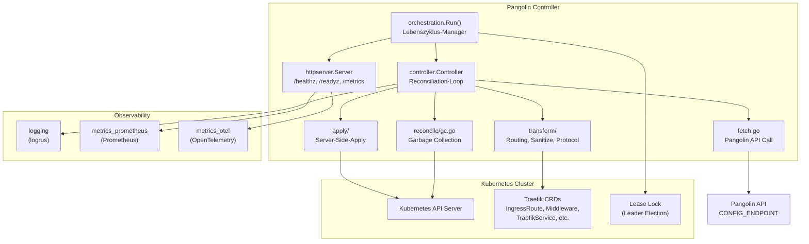
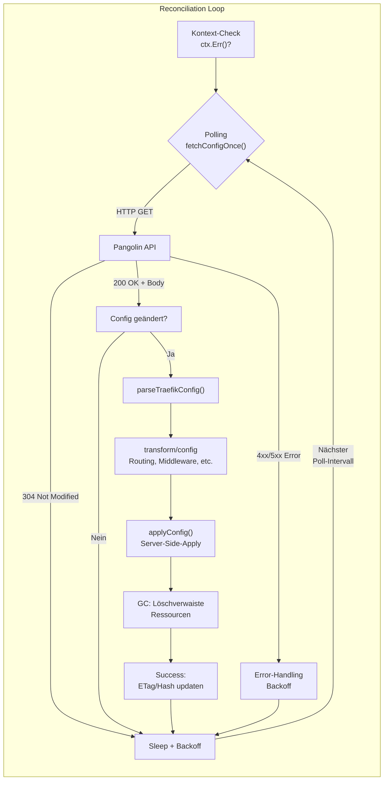
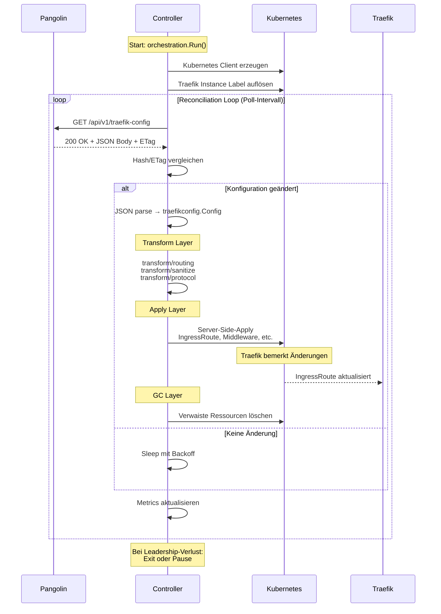
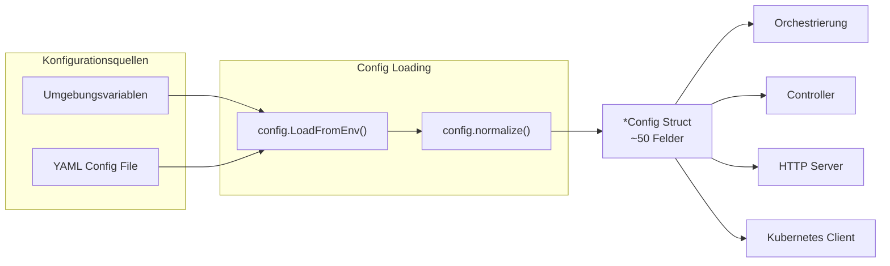
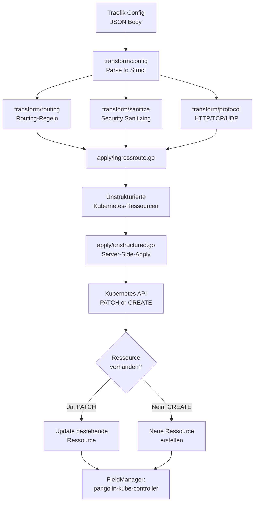
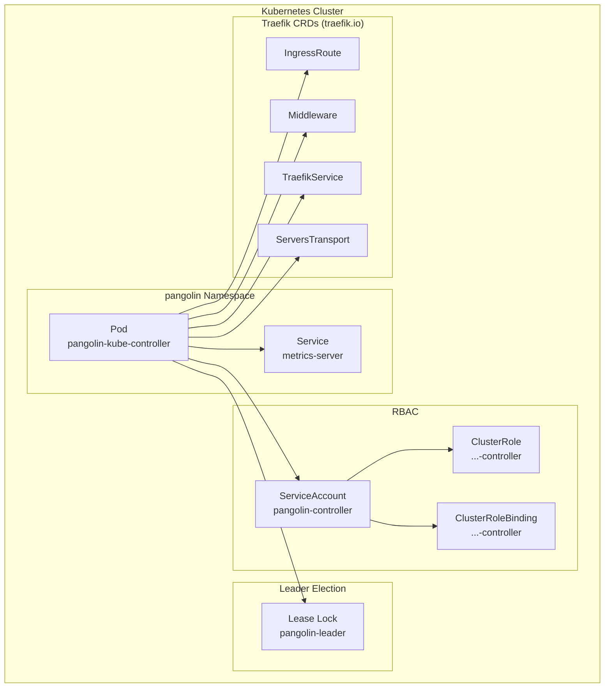
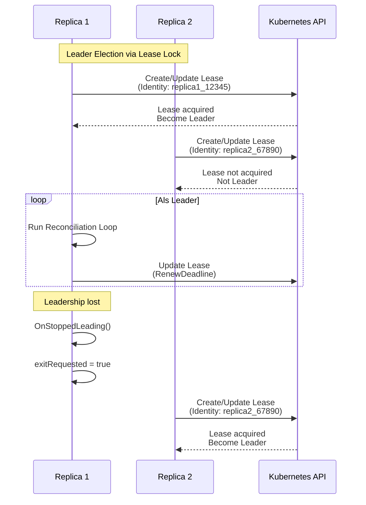
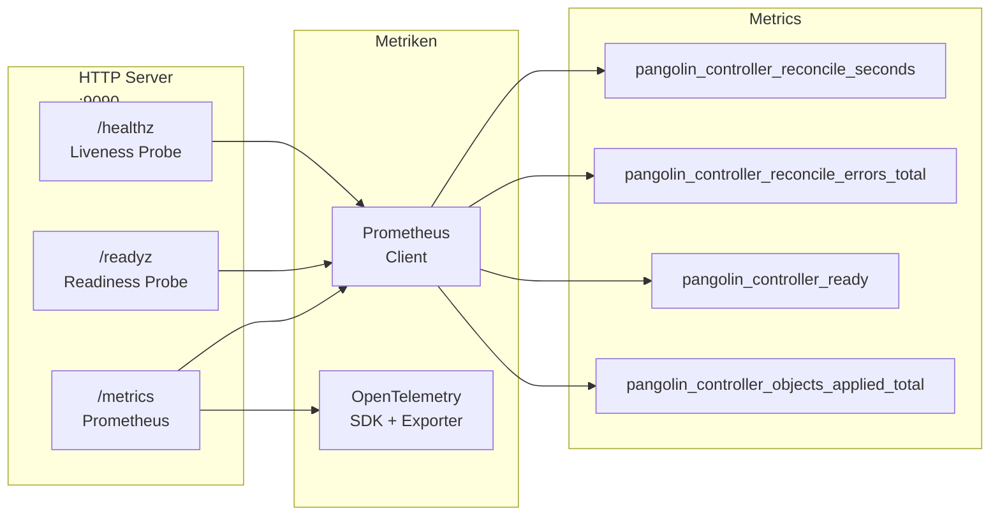

<!-- markdownlint-disable MD024 MD025 MD036 MD060 -->
# Pangolin Kubernetes Controller – Vollständige Repository-Dokumentation

---

# 1. Executive Summary des Repositories

## Worum es sich bei dem Projekt handelt

**Pangolin Kubernetes Controller** ist ein Kubernetes Operator (Custom Controller), der Traefik-Dynamic-Configuration von einem externen Dienst namens "Pangolin" abruft und diese in Kubernetes-Ressourcen übersetzt. Er fungiert als **Bridge** zwischen einem externen Konfigurationssystem (Pangolin) und dem Kubernetes-Ökosystem (Traefik CRDs).

## Vermutete Hauptaufgabe des Systems

Der Controller:

1. **Pollt** regelmäßig einen REST-Endpunkt (`CONFIG_ENDPOINT`) für die Traefik-Konfiguration
2. **Transformiert** die empfangene Konfiguration in Kubernetes-native Traefik-CRDs (IngressRoute, Middleware, TraefikService, etc.)
3. **Applyt** diese Ressourcen auf den Kubernetes-API-Server mittels Server-Side-Apply
4. **Reconciled** kontinuierlich den gewünschten Zustand (Pangolin) mit dem Ist-Zustand (Kubernetes)
5. **Garbage-Collectet** verwaiste Ressourcen, die nicht mehr in der Pangolin-Konfiguration vorhanden sind
6. **Exportiert** Prometheus/OpenTelemetry-Metriken für Observability
7. **Unterstützt** Leader Election für hochverfügbare Deployments

## Technologiestack

| Kategorie | Technologie |
|-----------|-------------|
| **Sprache** | Go 1.26.1 |
| **Kubernetes Client** | `k8s.io/client-go` v0.35.3, `sigs.k8s.io/controller-runtime` v0.23.3 |
| **CRDs** | Traefik.io v1alpha1 (IngressRoute, Middleware, TraefikService, ServersTransport, IngressRouteTCP/UDP, ServersTransportTCP) |
| **Konfiguration** | Umgebungsvariablen + optionales ConfigFile |
| **Logging** | `sirupsen/logrus` v1.9.4 |
| **Metrics** | Prometheus Client (`prometheus/client_golang`), OpenTelemetry SDK |
| **HTTP** | Standardbibliothek `net/http` |
| **Serialization** | JSON |

## Release-/Deployment-Modell

- **Release**: GitHub Releases via `release.yml` Workflow
- **Container-Registry**: GitHub Container Registry (`ghcr.io`)
- **Versionierung**: Semantische Versionierung (Tags)

## Test- und Qualitätsstrategie

- **Unit-Tests**: Go-Standardtests entlang der Pakete (`*_test.go`)
- **Integration-Tests**: `test/integration/` mit `envtest` (Kubernetes-API-Testframework)
- **E2E-Tests**: `test/e2e/` (offline-Tests)
- **CI/CD**: GitHub Actions (`ci.yml`, `build-publish.yml`, `release.yml`)
- **Linting**: `golangci-lint`, `hadolint`, `yamllint`, `markdownlint`, `shellcheck`
- **Security**: CodeQL, Trivy, DeepSource, Semgrep, Gosec
- **Coverage**: Coverprofiles (atomic mode), Mindest-Schwelle 75%

## Security-/Compliance-Charakter

- **TLS-Verify-Flag** für Pangolin-API (`CONFIG_TLS_SKIP_VERIFY`)
- **mTLS-Unterstützung** via CAFile, ClientCertFile, ClientKeyFile
- **ReadOnly-Modus** für nicht-mutierende Operationen
- **Leader Election** mit Kubernetes Lease Locks
- **Security-Policy**: `SECURITY.md`
- **OpenSSF Best Practices Badge** angestrebt

## Kurze Einschätzung der Architektur

Der Controller folgt dem **Operator-Pattern** mit klarem Schichtenaufbau:

- `cmd/` → Einstiegspunkt
- `internal/orchestration/` → Lebenszyklus-Orchestrierung
- `internal/controller/` → Reconciliation-Loop
- `internal/transform/` → Konfigurations-Transformation
- `internal/apply/` → Server-Side-Apply
- `internal/kube/` → Kubernetes-Client-Abstraktion
- `internal/httpserver/` → HTTP-Server für Metrics/Health
- `internal/observability/` → Logging, Metrics, Tracing

---

# 2. Architekturüberblick

## Einstiegspunkte

### `cmd/controller/main.go`

Der **primäre Einstiegspunkt** für den Haupt-Controller. Startet die Orchestrierung mit:

- Signal-Handler für SIGTERM/SIGINT
- Konfiguration aus Umgebungsvariablen
- Version-Logging

### `cmd/healthcheck/main.go`

**Sekundärer Einstiegspunkt** für einen dedizierten Health-Check-Prozess (oder Test-Harness).

## Kernmodule

| Paket | Verantwortung |
|-------|--------------|
| `internal/orchestration` | Lebenszyklus-Management: HTTP-Server, Leader Election, Label-Monitoring, graceful Shutdown |
| `internal/controller` | Reconciliation-Loop: Polling, Fetch, Parse, Apply, Change Detection, Backoff, Garbage Collection |
| `internal/transform` | Traefik-Config-Transformation: Routing, Sanitizing, Protocol-Adaption |
| `internal/apply` | Server-Side-Apply für Kubernetes-Ressourcen |
| `internal/kube` | Kubernetes-Client-Factory, Label-Resolution |
| `internal/config` | Konfigurationsladung aus Env/Dateien |
| `internal/httpserver` | HTTP-Server (Metrics, Health-Probes) |
| `internal/observability` | Logging, Prometheus-Metrics, OpenTelemetry-Metrics |

## Paketstruktur

```text
cmd/
├── controller/          # Haupt-Controller
│   ├── main.go
│   ├── main_test.go
│   └── doc.go
└── healthcheck/         # Healthcheck-Harness
    ├── main.go
    ├── main_test.go
    └── doc.go

internal/
├── orchestration/       # Run-Orchestrierung
├── controller/          # Kern-Controller-Logik
│   ├── loop.go          # Reconciliation-Polling-Loop
│   ├── apply.go         # Config-Anwendung
│   ├── fetch.go         # Pangolin-API-Call
│   ├── reconcile/       # Reconciliation + GC
│   └── ...
├── config/              # Konfigurationsmanagement
├── transform/           # Traefik-Config-Transformation
│   ├── config/          # Traefik-Datenmodelle
│   ├── protocol/        # HTTP/TCP/UDP-Protokoll-Logik
│   ├── routing/         # Routing-Regeln
│   └── sanitize/        # Eingabebereinigung
├── apply/               # Server-Side-Apply
├── kube/                # Kubernetes-Client
│   ├── labels/          # Label-Auflösung
│   └── resources/       # Resource-Adapter
├── httpserver/          # HTTP-Server
│   ├── server.go
│   ├── routes.go
│   └── tls.go
├── observability/        # Observability
│   ├── logging/
│   ├── metrics_prometheus/
│   └── metrics_otel/
├── testschema/          # CRD-Testhilfen
├── testutil/            # Test-Tools
└── version/             # Build-Version
```

## Typische Datenflüsse

```text
Pangolin-API (HTTP)
        │
        ▼
┌───────────────────┐
│  fetch.go         │ ← ETag/If-None-Match, Conditional Fetch
└────────┬──────────┘
         ▼
┌───────────────────┐
│  parseTraefikConfig│ → traefikconfig.Config
└────────┬──────────┘
         ▼
┌───────────────────┐
│  transform/config │ ← Routing, Middleware, Services
│  transform/routing│
│  transform/sanitize│
└────────┬──────────┘
         ▼
┌───────────────────┐
│  apply.go         │ ← Server-Side-Apply
└────────┬──────────┘
         ▼
┌───────────────────┐
│  Kubernetes API   │ ← IngressRoute, Middleware, etc.
└───────────────────┘
```

## Unterschied zwischen Top-Level-Verzeichnissen

| Verzeichnis | Art | Zweck |
|------------|-----|-------|
| `cmd/` | **Produktiv-Code** | Einstiegspunkte (main-Pakete) |
| `internal/` | **Produktiv-Code** | Kernlogik, keine externe Import erwartet |
| `test/` | **Test-Code** | Integrationstests, E2E-Tests, Test-Fixtures |
| `docs/` | **Dokumentation** | Benutzer- und Entwicklerdokumentation |
| `hack/` | **Build-/Release-Tools** | Taskfiles, Scripts, Hilfsprogramme |
| `.github/` | **CI/CD** | GitHub Actions Workflows, Templates |

## Welche Teile produktiv und welche nur Entwicklungsprozess betreffen

| Kategorie | Pfade |
|-----------|-------|
| **Produktiv-Laufzeit** | `cmd/controller/main.go`, `internal/` (ohne `test*`) |
| **Build & Release** | `Taskfile.yml`, `Dockerfile`, `hack/scripts/`, `hack/taskfiles/` |
| **Test** | `*_test.go` Dateien, `test/integration/`, `test/e2e/`, `internal/testschema/`, `internal/testutil/` |
| **CI/CD** | `.github/workflows/`, `.github/actions/` |
| **Dokumentation** | `docs/`, `README.md`, `CONTRIBUTING.md`, `AGENTS.md` |
| **Tooling/Konfiguration** | `.golangci.yml`, `.yamllint.yaml`, `.deepsource.toml`, etc. |

---

# 3. Projekt-Detailbeschreibung mit Architekturdiagrammen

## Überblick

Der **Pangolin Kubernetes Controller** ist ein Kubernetes Operator, der als Bridge zwischen dem Pangolin-Konfigurationsdienst und Traefik-CRDs fungiert. Er implementiert einen typischen **Reconciliation-Loop**, wie er in Kubernetes Controllern üblich ist.

## Hauptkomponenten und deren Interaktion



## Reconciliation-Loop (Hauptschleife)

Der Controller implementiert einen **ereignisgesteuerten Polling-Loop**, der in regelmäßigen Intervallen die Konfiguration von Pangolin abruft:



## Datenfluss (Detail)



## Konfigurationsfluss



## Server-Side-Apply Flow



## Deployment-Architektur



## High-Availability-Modus (Leader Election)



## HTTP-Server und Observability



---

# 4. Top-Level-Inventar

## `.deepsource.toml`

**Typ**: Konfigurationsdatei (Tooling)  
**Zweck**: DeepSource-Code-Analyse-Konfiguration  
**Bedeutung**: Statische Code-Analyse und technische Schulden-Verfolgung  
**Kategorie**: Quality Assurance / Security  

## `.dockerignore`

**Typ**: Docker-Build-Konfiguration  
**Zweck**: Dateien/Verzeichnisse vom Docker-Build-Kontext ausschließen  
**Bedeutung**: Reduziert Docker-Image-Größe und Build-Zeit  
**Kategorie**: Build  

## `.editorconfig`

**Typ**: Editor-Konfiguration  
**Zweck**: Einheitliche Codierungsstile über Editoren hinweg  
**Bedeutung**: Konsistenz bei Zeilenumbrüchen, Einrückungen, Zeichensätzen  
**Kategorie**: Tooling  

## `.env` / `.env.example`

**Typ**: Umgebungsvariablen  
**Zweck**: Lokale Entwicklungskonfiguration (`.env`) und Vorlage (`.env.example`)  
**Bedeutung**: Enthält **lokale Entwicklungseinstellungen**, nicht für Produktion  
**Kategorie**: Config / Lokal  
**Hinweis**: `.env` enthält wahrscheinlich echte Secrets für lokale Entwicklung

## `.gitattributes`

**Typ**: Git-Konfiguration  
**Zweck**: Git-Attribute für Dateien (z.B. Zeilenenden-Normalisierung)  
**Bedeutung**: Konsistenz über Betriebssysteme hinweg  
**Kategorie**: VCS  

## `.github/`

**Typ**: Verzeichnis  
**Zweck**: GitHub-spezifische Dateien (Workflows, Actions, Templates)  
**Bedeutung**: CI/CD, Issue/PR-Templates, Security-Scanning  
**Kategorie**: CI/CD  

## `.gitignore`

**Typ**: Git-Konfiguration  
**Zweck**: Dateien/Verzeichnisse von Git-Tracking ausschließen  
**Bedeutung**: Verhindert unbeabsichtigtes Committen von Build-Artefakten, Secrets, etc.  
**Kategorie**: VCS  

## `.golangci.yml`

**Typ**: Linter-Konfiguration  
**Zweck**: golangci-lint Konfiguration (Linting-Regeln)  
**Bedeutung**: Code-Qualitätsstandards durchsetzen  
**Kategorie**: Quality Assurance  

## `.hadolint.yaml`

**Typ**: Linter-Konfiguration  
**Zweck**: Hadolint-Konfiguration für Dockerfile-Analyse  
**Bedeutung**: Docker-Best-Practices  
**Kategorie**: Quality Assurance  

## `.markdownlint-cli2.yaml`

**Typ**: Linter-Konfiguration  
**Zweck**: Markdown-Linting-Konfiguration  
**Bedeutung**: Dokumentationsqualität  
**Kategorie**: Quality Assurance  

## `.semgrep.yml`

**Typ**: Security-Scanner-Konfiguration  
**Zweck**: Semgrep-Regeln für statische Sicherheitsanalyse  
**Bedeutung**: Security-Auditing  
**Kategorie**: Security  

## `.sonarlint/`

**Typ**: Verzeichnis  
**Zweck**: SonarLint-Konfiguration für IDE-Integration  
**Bedeutung**: Lokale Code-Analyse  
**Kategorie**: Tooling  

## `.task/`

**Typ**: Verzeichnis  
**Zweck**: Wahrscheinlich Cache/State für den `task`-Taskrunner  
**Bedeutung**: Nicht für Versionskontrolle relevant  
**Kategorie**: Lokal/Artefakt  

## `.trivyignore`

**Typ**: Security-Konfiguration  
**Zweck**: Trivy-Container-Scanner ignorieren bestimmte Findings  
**Bedeutung**: Reduziert Rauschen bei Security-Scans  
**Kategorie**: Security  

## `.vscode/`

**Typ**: Verzeichnis  
**Zweck**: VSCode Workspace-Konfiguration  
**Bedeutung**: Editor-spezifische Einstellungen für Contributors  
**Kategorie**: Editor  

## `.yamllint.yaml`

**Typ**: Linter-Konfiguration  
**Zweck**: YAML-Validierung für Kubernetes-Manifests und CI-Konfiguration  
**Bedeutung**: YAML-Qualität  
**Kategorie**: Quality Assurance  

## `AGENTS.md`

**Typ**: Dokumentation  
**Zweck**: Anweisungen für AI-Agents (wie mich), die dieses Repository bearbeiten  
**Bedeutung**: Definiert Workflow-Standards, Coding-Conventions, Quick-Start-Befehle  
**Kategorie**: Contributor-Dokumentation  

## `CHANGELOG.md`

**Typ**: Dokumentation  
**Zweck**: Historie der Releases und Änderungen  
**Bedeutung**: Release-Notes für Benutzer  
**Kategorie**: Release-Dokumentation  

## `CODE_OF_CONDUCT.md`

**Typ**: Dokumentation  
**Zweck**: Verhaltensregeln für Contributors  
**Bedeutung**: Community-Standards  
**Kategorie**: Community  

## `CONTRIBUTING.md`

**Typ**: Dokumentation  
**Zweck**: Beitragsrichtlinien und Workflow-Informationen  
**Bedeutung**: Onboarding für neue Contributors  
**Kategorie**: Contributor-Dokumentation  

## `Dockerfile`

**Typ**: Docker-Build-Konfiguration  
**Zweck**: Multi-Stage-Build für das Haupt-Container-Image  
**Bedeutung**: Produktiv-Release-Image  
**Kategorie**: Build / Release  

## `Dockerfile.scratch`

**Typ**: Docker-Build-Konfiguration  
**Zweck**: Minimal-Image ohne Betriebssystem (scratch-Basis)  
**Bedeutung**: Maximale Reduzierung der Angriffsfläche  
**Kategorie**: Build / Release  

## `LICENSE`

**Typ**: Dokumentation (Rechtlich)  
**Zweck**: Open-Source-Lizenz (vermutlich MIT oder Apache 2.0)  
**Bedeutung**: Rechtliche Nutzungsbedingungen  
**Kategorie**: Legal  

## `MAINTAINERS.md`

**Typ**: Dokumentation  
**Zweck**: Informationen über Projekt-Maintainer  
**Bedeutung**: Verantwortlichkeiten und Kontakte  
**Kategorie**: Governance  

## `README.md`

**Typ**: Dokumentation  
**Zweck**: Hauptdokumentation für Benutzer und Einsteiger  
**Bedeutung**: Überblick, Quickstart, Konfiguration, Metrics  
**Kategorie**: Benutzer-Dokumentation  

## `SECURITY.md`

**Typ**: Dokumentation  
**Zweck**: Sicherheitsrichtlinie und Vulnerability-Reporting  
**Bedeutung**: Security-Compliance  
**Kategorie**: Security  

## `SUPPORT.md`

**Typ**: Dokumentation  
**Zweck**: Support-Kanäle und Ressourcen  
**Bedeutung**: Hilfestellung für Benutzer  
**Kategorie**: Benutzer-Dokumentation  

## `Taskfile.yml`

**Typ**: Build-Konfiguration  
**Zweck**: Task-Taskrunner-Konfiguration (Alternative zu Make)  
**Bedeutung**: Standardisierte Build-, Test-, Release-Tasks  
**Kategorie**: Build  

## `VERSION`

**Typ**: Artefakt  
**Zweck**: Enthält die aktuelle Versionsnummer (z.B. `1.0.0`)  
**Bedeutung**: Wird während des Builds via `-ldflags` eingelesen  
**Kategorie**: Build-Artefakt  

## `commitlint.config.mjs`

**Typ**: CI-Konfiguration  
**Zweck**: Commit-Message-Format-Validierung (Conventional Commits)  
**Bedeutung**: Konsistente Commit-Historie  
**Kategorie**: CI/CD  

## `docs/`

**Typ**: Verzeichnis  
**Zweck**: Umfangreiche Dokumentation (Bau, Releases, Controller, CI/CD, Archive)  
**Bedeutung**: Tiefe technische Dokumentation  
**Kategorie**: Dokumentation  

## `go.mod` / `go.sum`

**Typ**: Go-Modul-Konfiguration  
**Zweck**: Abhängigkeitsmanagement  
**Bedeutung**: Build-Reproduzierbarkeit  
**Kategorie**: Build  

## `hack/`

**Typ**: Verzeichnis  
**Zweck**: Hilfsskripte und Taskfiles für Build/Release-Prozesse  
**Bedeutung**: CI/CD-Unterstützung  
**Kategorie**: Tooling  

## `internal/`

**Typ**: Verzeichnis  
**Zweck**: Private Pakete mit Kernlogik. Nicht für externe Import vorgesehen.  
**Bedeutung**: Haupt-Codebase  
**Kategorie**: Produktiv-Code  

## `renovate.json`

**Typ**: Konfigurationsdatei  
**Zweck**: Renovate-Bot-Konfiguration für automatisierte Dependency-Updates  
**Bedeutung**: Halten Dependencies aktuell  
**Kategorie**: CI/CD / Security  

## `sonar-project.properties`

**Typ**: Tooling-Konfiguration  
**Zweck**: SonarQube/Scanner-Konfiguration  
**Bedeutung**: Code-Qualitätsanalyse  
**Kategorie**: Quality Assurance  

## `test/`

**Typ**: Verzeichnis  
**Zweck**: Integrationstests und E2E-Tests  
**Bedeutung**: Test-Infrastruktur  
**Kategorie**: Test  

## `unit.out`

**Typ**: Artefakt  
**Zweck**: Coverage-Profile von Unit-Tests  
**Bedeutung**: Lokales Test-Artefakt  
**Kategorie**: Test-Artefakt  
**Hinweis**: Sollte in `.gitignore` sein  

---

# 5. Detaillierte Verzeichnis- und Dateibeschreibung

## `cmd/`

### Zweck

Einstiegspunkte für ausführbare Programme (Go-Main-Pakete).

### Kategorie

**Produktiv-Code / Laufzeit**

---

### `cmd/controller/`

**Haupt-Controller-Anwendung**.

#### `cmd/controller/main.go`

- **Kategorie**: Code (Produktiv)
- **Zweck**: Primärer Einstiegspunkt. Initialisiert Logging, lädt Konfiguration, startet `orchestration.Run()`
- **Nutzergruppe**: Ops/Production
- **Kritikalität**: Hoch
- **Status**: Aktiv

#### `cmd/controller/main_test.go`

- **Kategorie**: Test
- **Zweck**: Integrationstest der main-Funktion (Exit-Codes, Fehlerfälle)
- **Nutzergruppe**: Entwickler
- **Kritikalität**: Mittel
- **Status**: Aktiv

#### `cmd/controller/doc.go`

- **Kategorie**: Dokumentation (Go-Doc)
- **Zweck**: Package-Dokumentation
- **Nutzergruppe**: Entwickler
- **Kritikalität**: Niedrig
- **Status**: Aktiv

---

### `cmd/healthcheck/`

**Dedizierter Health-Check-Prozess** (vermutlich für Kubernetes Liveness/Readiness-Probes oder Test-Harness).

#### `cmd/healthcheck/main.go`

- **Kategorie**: Code (Produktiv)
- **Zweck**: Healthcheck-Harness
- **Nutzergruppe**: Ops/Production
- **Kritikalität**: Mittel
- **Status**: Aktiv

#### `cmd/healthcheck/main_test.go`

- **Kategorie**: Test
- **Zweck**: Tests für Healthcheck
- **Nutzergruppe**: Entwickler
- **Kritikalität**: Niedrig
- **Status**: Aktiv

#### `cmd/healthcheck/doc.go`

- **Kategorie**: Dokumentation (Go-Doc)
- **Zweck**: Package-Dokumentation
- **Nutzergruppe**: Entwickler
- **Kritikalität**: Niedrig
- **Status**: Aktiv

---

## `internal/`

### Zweck

Private Pakete mit Kernlogik. Nicht für externe Import vorgesehen.

### Kategorie

**Produktiv-Code / Kernlogik**

---

### `internal/orchestration/`

**Lebenszyklus-Orchestrierung**: Startet HTTP-Server, Leader Election, Label-Monitoring und koordiniert graceful Shutdown.

#### `internal/orchestration/run.go`

- **Kategorie**: Code (Produktiv)
- **Zweck**: Zentrale Orchestrierung - baut Kubernetes-Clients, startet HTTP-Server, Leader-Election-Loop, Label-Monitoring parallel, koordiniert Shutdown
- **Nutzergruppe**: Ops/Production
- **Kritikalität**: Hoch
- **Status**: Aktiv
- **Beziehungen**:
  - `cmd/controller/main.go` → `orchestration.Run()`
  - Abhängig von `kube.NewClients`, `labels.ResolveInstanceLabel`, `controller.NewController`
  - Startet `inthttp.Server`, `leaderelection.RunOrDie`

#### `internal/orchestration/run_test.go`

- **Kategorie**: Test
- **Zweck**: Unit-Tests für die Orchestrierungslogik (HTTP-Server-Start, Shutdown, Graceful-Shutdown)
- **Nutzergruppe**: Entwickler
- **Kritikalität**: Mittel
- **Status**: Aktiv

---

### `internal/controller/`

**Kern-Controller-Logik**: Reconciliation-Loop, Fetch, Apply, Change Detection, Backoff, Leader Election, Readiness, Garbage Collection.

#### `internal/controller/controller.go`

- **Kategorie**: Code (Produktiv)
- **Zweck**: Haupt-Controller-Struktur mit GVR-(GroupVersionResource)-Definitionen für Traefik-CRDs, HTTP-Client-Konfiguration, Graceful-Deletion-Queue, Leader-Election-Identity
- **Nutzergruppe**: Ops/Production
- **Kritikalität**: Hoch
- **Status**: Aktiv
- **Tracked CRDs**: IngressRoute, Middleware, TraefikService, ServersTransport, IngressRouteTCP, IngressRouteUDP, ServersTransportTCP

#### `internal/controller/loop.go`

- **Kategorie**: Code (Produktiv)
- **Zweck**: Haupt-Polling-Loop: Fetch → Parse → Apply → Sleep mit Backoff. ETag/If-None-Match, Hash-basierte Änderungserkennung
- **Nutzergruppe**: Ops/Production
- **Kritikalität**: Hoch
- **Status**: Aktiv
- **Beziehungen**: `fetchConfigOnce()`, `parseTraefikConfig()`, `applyConfig()`

#### `internal/controller/fetch.go`

- **Kategorie**: Code (Produktiv)
- **Zweck**: HTTP-Fetch vom Pangolin-API mit Timeout, Auth-Header, TLS-Skip-Verify, Conditional-Request (ETag)
- **Nutzergruppe**: Ops/Production
- **Kritikalität**: Hoch
- **Status**: Aktiv

#### `internal/controller/apply.go`

- **Kategorie**: Code (Produktiv)
- **Zweck**: Server-Side-Apply der transformierten Traefik-Konfiguration auf Kubernetes. Behandelt upsert/delete pro CRD-Typ
- **Nutzergruppe**: Ops/Production
- **Kritikalität**: Hoch
- **Status**: Aktiv
- **Beziehungen**: `internal/apply/`, `reconcile/gc.go`

#### `internal/controller/change_detection.go`

- **Kategorie**: Code (Produktiv)
- **Zweck**: Bestimmt, ob sich die Konfiguration geändert hat (Hash-Vergleich, ETag-Vergleich)
- **Nutzergruppe**: Ops/Production
- **Kritikalität**: Hoch
- **Status**: Aktiv

#### `internal/controller/backoff.go`

- **Kategorie**: Code (Produktiv)
- **Zweck**: Exponentieller Backoff bei Fehlern (verhindert Crash-Loops)
- **Nutzergruppe**: Ops/Production
- **Kritikalität**: Mittel
- **Status**: Aktiv

#### `internal/controller/leader_election.go`

- **Kategorie**: Code (Produktiv)
- **Zweck**: Kubernetes Lease-basiertes Leader Election. Nur ein Controller-Replica active zu jedem Zeitpunkt
- **Nutzergruppe**: Ops/Production
- **Kritikalität**: Hoch
- **Status**: Aktiv

#### `internal/controller/readiness.go`

- **Kategorie**: Code (Produktiv)
- **Zweck**: Readiness-Probe-Logik (Kubernetes-Client-Verbindung, Leader-Lease)
- **Nutzergruppe**: Ops/Production
- **Kritikalität**: Mittel
- **Status**: Aktiv

#### `internal/controller/doc.go`

- **Kategorie**: Dokumentation
- **Zweck**: Package-Dokumentation
- **Nutzergruppe**: Entwickler
- **Kritikalität**: Niedrig
- **Status**: Aktiv

**Testdateien** (alle Kategorie: Test, Nutzergruppe: Entwickler, Kritikalität: Mittel):

- `apply_extra_test.go`, `apply_test.go`
- `backoff_extra_test.go`, `backoff_test.go`
- `change_detection_test.go`
- `controller_test.go`
- `fetch_extra_test.go`, `fetch_test.go`
- `leader_election_extra_test.go`, `leader_election_test.go`
- `loop_extra_test.go`, `loop_test.go`
- `readiness_test.go`

---

### `internal/reconcile/`

**Reconciliation-spezifische Logik und Garbage Collection**.

#### `internal/reconcile/gc.go`

- **Kategorie**: Code (Produktiv)
- **Zweck**: Garbage Collection: Löscht Traefik-Ressourcen, die nicht mehr in der Pangolin-Konfiguration vorhanden sind
- **Nutzergruppe**: Ops/Production
- **Kritikalität**: Hoch
- **Status**: Aktiv

#### `internal/reconcile/doc.go`

- **Kategorie**: Dokumentation
- **Zweck**: Package-Dokumentation
- **Nutzergruppe**: Entwickler
- **Kritikalität**: Niedrig
- **Status**: Aktiv

#### `internal/reconcile/gc_test.go`

- **Kategorie**: Test
- **Zweck**: GC-Tests
- **Nutzergruppe**: Entwickler
- **Kritikalität**: Mittel
- **Status**: Aktiv

---

### `internal/apply/`

**Server-Side-Apply-Schicht**: Transformiert Traefik-Config in Kubernetes-Ressourcen und applies sie.

#### `internal/apply/endpointslice.go`

- **Kategorie**: Code (Produktiv)
- **Zweck**: EndpointSlice-Ressourcen applyen
- **Nutzergruppe**: Ops/Production
- **Kritikalität**: Mittel
- **Status**: Aktiv

#### `internal/apply/ingressroute.go`

- **Kategorie**: Code (Produktiv)
- **Zweck**: IngressRoute-CRDs applyen
- **Nutzergruppe**: Ops/Production
- **Kritikalität**: Hoch
- **Status**: Aktiv

#### `internal/apply/metadata.go`

- **Kategorie**: Code (Produktiv)
- **Zweck**: Gemeinsame Metadata-Behandlung (Annotations, Labels, Owner-References)
- **Nutzergruppe**: Ops/Production
- **Kritikalität**: Mittel
- **Status**: Aktiv

#### `internal/apply/numeric.go`

- **Kategorie**: Code (Produktiv)
- **Zweck**: Numerische Feld-Behandlung bei Server-Side-Apply (z.B. Port-Nummern)
- **Nutzergruppe**: Ops/Production
- **Kritikalität**: Niedrig
- **Status**: Aktiv

#### `internal/apply/service.go`

- **Kategorie**: Code (Produktiv)
- **Zweck**: Kubernetes Service-Ressourcen applyen
- **Nutzergruppe**: Ops/Production
- **Kritikalität**: Mittel
- **Status**: Aktiv

#### `internal/apply/unstructured.go`

- **Kategorie**: Code (Produktiv)
- **Zweck**: Generisches Server-Side-Apply für unstrukturierte Ressourcen
- **Nutzergruppe**: Ops/Production
- **Kritikalität**: Hoch
- **Status**: Aktiv

#### `internal/apply/diff.go`

- **Kategorie**: Code (Produktiv)
- **Zweck**: Differenz-Analyse zwischen Ist- und Soll-Zustand
- **Nutzergruppe**: Ops/Production
- **Kritikalität**: Mittel
- **Status**: Aktiv

#### `internal/apply/doc.go`

- **Kategorie**: Dokumentation
- **Zweck**: Package-Dokumentation
- **Nutzergruppe**: Entwickler
- **Kritikalität**: Niedrig
- **Status**: Aktiv

**Testdateien**:

- `endpointslice_test.go`, `ingressroute_test.go`, `metadata_test.go`, `numeric_test.go`, `service_test.go`, `unstructured_test.go`, `diff_test.go`, `apply_extra_test.go`, `test_consts_test.go`

---

### `internal/config/`

**Konfigurationsmanagement**: Lädt und validiert Konfiguration aus Umgebungsvariablen und optionalem ConfigFile.

#### `internal/config/config.go`

- **Kategorie**: Code (Produktiv)
- **Zweck**: Config-Strukt mit ~50 Feldern (PollInterval, Endpoint, Namespace, LeaderElection, TLS, HTTP, Metrics, GC, etc.)
- **Nutzergruppe**: Ops/Production
- **Kritikalität**: Hoch
- **Status**: Aktiv

#### `internal/config/env.go`

- **Kategorie**: Code (Produktiv)
- **Zweck**: Umgebungsvariablen parsen und in Config-Strukt laden
- **Nutzergruppe**: Ops/Production
- **Kritikalität**: Hoch
- **Status**: Aktiv

#### `internal/config/file.go`

- **Kategorie**: Code (Produktiv)
- **Zweck**: Optionales ConfigFile (YAML) einlesen und mit Env-Variablen mergen
- **Nutzergruppe**: Ops/Production
- **Kritikalität**: Mittel
- **Status**: Aktiv

#### `internal/config/defaults.go`

- **Kategorie**: Code (Produktiv)
- **Zweck**: Konfigurations-Defaults setzen
- **Nutzergruppe**: Ops/Production
- **Kritikalität**: Mittel
- **Status**: Aktiv

#### `internal/config/normalize.go`

- **Kategorie**: Code (Produktiv)
- **Zweck**: Normalisierung und Validierung der Konfiguration
- **Nutzergruppe**: Ops/Production
- **Kritikalität**: Mittel
- **Status**: Aktiv

#### `internal/config/doc.go`

- **Kategorie**: Dokumentation
- **Zweck**: Package-Dokumentation
- **Nutzergruppe**: Entwickler
- **Kritikalität**: Niedrig
- **Status**: Aktiv

**Testdateien**: `config_test.go`, `env_test.go`

---

### `internal/transform/`

**Konfigurations-Transformation**: Übersetzt Traefik-Dynamic-Configuration in Kubernetes-CRUD-Operationen.

#### `internal/transform/doc.go`

- **Kategorie**: Dokumentation
- **Zweck**: Package-Dokumentation
- **Nutzergruppe**: Entwickler
- **Kritikalität**: Niedrig
- **Status**: Aktiv

---

##### `internal/transform/config/`

**Traefik-Datenmodelle**.

###### `internal/transform/config/config.go`

- **Kategorie**: Code (Produktiv)
- **Zweck**: Definiert `Config`, `HTTPConfig`, `TCPUDPConfig` - die Traefik-Dynamic-Configuration-Modelle (Group: traefik.io, Version: v1alpha1)
- **Nutzergruppe**: Ops/Production
- **Kritikalität**: Hoch
- **Status**: Aktiv
- **Definiert Konstanten**: `Group`, `Version`, `GroupVersion`

---

##### `internal/transform/protocol/`

**Protokoll-spezifische Logik** (HTTP, TCP, UDP).

###### `internal/transform/protocol/tcp_udp.go`

- **Kategorie**: Code (Produktiv)
- **Zweck**: TCP/UDP-Protokoll-Transformation
- **Nutzergruppe**: Ops/Production
- **Kritikalität**: Mittel
- **Status**: Aktiv

**Testdateien**: `tcp_udp_test.go`, `tcp_udp_additional_test.go`, `endpoint_slice_test.go`, `env_url_test.go`, `http_conversion_test.go`, `http_conversion_regression_test.go`, `loadbalancer_error_test.go`, `port_parse_test.go`, `process_services_test.go`, `service_processing_test.go`, `service_target_equals_test.go`, `service_target_test.go`, `service_url_port_test.go`, `split_host_port_test.go`, `servers_transport_inject_test.go`, `address_type_test.go`

---

##### `internal/transform/routing/`

**Routing-Regel-Transformation**.

###### `internal/transform/routing/routing.go`

- **Kategorie**: Code (Produktiv)
- **Zweck**: Routing-Regeln transformieren
- **Nutzergruppe**: Ops/Production
- **Kritikalität**: Mittel
- **Status**: Aktiv

**Testdateien**: `routing_test.go`, `router_priority_test.go`, `annotation_test.go`, `entrypoints_annotation_test.go`, `entrypoints_test.go`, `transform_test.go`, `test_consts_test.go`

---

##### `internal/transform/sanitize/`

**Eingabebereinigung**.

###### `internal/transform/sanitize/sanitize.go`

- **Kategorie**: Code (Produktiv)
- **Zweck**: Bereinigung von Benutzereingaben (Security!)
- **Nutzergruppe**: Ops/Production
- **Kritikalität**: Mittel
- **Status**: Aktiv

**Testdateien**: `sanitize_test.go`, `sanitize_extra_test.go`, `reference_test.go`, `router_middleware_order_test.go`, `servers_transport_test.go`

---

##### `internal/transform/testutil/`

**Test-Hilfsmittel für Transform-Tests**.

###### `internal/transform/testutil/objects.go`

- **Kategorie**: Test
- **Zweck**: Test-Fixtures für Transform-Tests
- **Nutzergruppe**: Entwickler
- **Kritikalität**: Niedrig
- **Status**: Aktiv

---

### `internal/kube/`

**Kubernetes-Client-Abstraktion**.

#### `internal/kube/client.go`

- **Kategorie**: Code (Produktiv)
- **Zweck**: Kubernetes-Client-Factory (RESTMapper, DynamicClient, TypedClient)
- **Nutzergruppe**: Ops/Production
- **Kritikalität**: Hoch
- **Status**: Aktiv

#### `internal/kube/doc.go`

- **Kategorie**: Dokumentation
- **Zweck**: Package-Dokumentation
- **Nutzergruppe**: Entwickler
- **Kritikalität**: Niedrig
- **Status**: Aktiv

---

##### `internal/kube/labels/`

**Label-Auflösung**.

###### `internal/kube/labels/resolver.go`

- **Kategorie**: Code (Produktiv)
- **Zweck**: Traefik Instance Label auflösen (automatische Erkennung via IngressClass oder manuelle Konfiguration)
- **Nutzergruppe**: Ops/Production
- **Kritikalität**: Mittel
- **Status**: Aktiv

---

##### `internal/kube/resources/`

**Resource-Adapter**.

###### `internal/kube/resources/resource_adapter.go`

- **Kategorie**: Code (Produktiv)
- **Zweck**: Abstrahiert Kubernetes-Ressourcen für einheitliche Behandlung
- **Nutzergruppe**: Ops/Production
- **Kritikalität**: Mittel
- **Status**: Aktiv

---

### `internal/httpserver/`

**HTTP-Server**: Metrics, Health-Probes (`/healthz`, `/readyz`, `/metrics`), optional TLS.

#### `internal/httpserver/server.go`

- **Kategorie**: Code (Produktiv)
- **Zweck**: HTTP-Server mit konfigurierbaren Endpoints, Graceful-Shutdown
- **Nutzergruppe**: Ops/Production
- **Kritikalität**: Hoch
- **Status**: Aktiv

#### `internal/httpserver/routes.go`

- **Kategorie**: Code (Produktiv)
- **Zweck**: Route-Registrierung (`/healthz`, `/readyz`, `/metrics`)
- **Nutzergruppe**: Ops/Production
- **Kritikalität**: Mittel
- **Status**: Aktiv

#### `internal/httpserver/tls.go`

- **Kategorie**: Code (Produktiv)
- **Zweck**: TLS-Konfiguration für HTTP-Server
- **Nutzergruppe**: Ops/Production
- **Kritikalität**: Mittel
- **Status**: Aktiv

#### `internal/httpserver/doc.go`

- **Kategorie**: Dokumentation
- **Zweck**: Package-Dokumentation
- **Nutzergruppe**: Entwickler
- **Kritikalität**: Niedrig
- **Status**: Aktiv

**Testdateien**: `server_test.go`, `routes_test.go`, `tls_test.go`

---

### `internal/observability/`

**Observability-Stack**: Logging, Prometheus-Metrics, OpenTelemetry-Metrics.

#### `internal/observability/logging/`

**Logging**.

##### `internal/observability/logging/redact.go`

- **Kategorie**: Code (Produktiv)
- **Zweck**: JSON-Log-Redaction (Sensible Daten in Logs unkenntlich machen)
- **Nutzergruppe**: Ops/Security
- **Kritikalität**: Mittel
- **Status**: Aktiv

#### `internal/observability/metrics_prometheus/`

**Prometheus-Metrics**.

##### `internal/observability/metrics_prometheus/metrics.go`

- **Kategorie**: Code (Produktiv)
- **Zweck**: Prometheus-Metric-Sammlung (`pangolin_controller_reconcile_seconds`, `pangolin_controller_reconcile_errors_total`, etc.)
- **Nutzergruppe**: Ops/Production
- **Kritikalität**: Hoch
- **Status**: Aktiv

#### `internal/observability/metrics_otel/`

**OpenTelemetry-Metrics**.

##### `internal/observability/metrics_otel/otelmetrics.go`

- **Kategorie**: Code (Produktiv)
- **Zweck**: OpenTelemetry-Metrics via Prometheus-Exporter
- **Nutzergruppe**: Ops/Production
- **Kritikalität**: Mittel
- **Status**: Aktiv

**Testdateien**: `shutdown_test.go` (beide Metrics-Pakete)

---

### `internal/version/`

**Build-Versionsinformation**.

#### `internal/version/version.go`

- **Kategorie**: Code (Produktiv)
- **Zweck**: Version, Commit, Date-Variablen (gesetzt via `-ldflags`)
- **Nutzergruppe**: Ops/Production
- **Kritikalität**: Niedrig
- **Status**: Aktiv

**Testdateien**: `version_test.go`

---

### `internal/pangolin/`

**Vermutlich Deprecated oder Legacy** - kein Code in der Auflistung außer `doc.go`.

#### `internal/pangolin/doc.go`

- **Kategorie**: Dokumentation
- **Zweck**: Package-Dokumentation
- **Hinweis**: Wahrscheinlich historisch, sollte geprüft werden

---

### `internal/testschema/`

**CRD-Testschema-Definition und Test-Tools**.

#### `internal/testschema/loader.go`

- **Kategorie**: Test
- **Zweck**: CRDs für Tests laden (benötigt für Integrationstests)
- **Nutzergruppe**: Entwickler
- **Kritikalität**: Mittel
- **Status**: Aktiv

#### `internal/testschema/scrub.go`

- **Kategorie**: Test
- **Zweck**: Sensible Daten in Test-CRDs entfernen
- **Nutzergruppe**: Entwickler
- **Kritikalität**: Niedrig
- **Status**: Aktiv

#### `internal/testschema/validate.go`

- **Kategorie**: Test
- **Zweck**: CRD-Validierung für Tests
- **Nutzergruppe**: Entwickler
- **Kritikalität**: Niedrig
- **Status**: Aktiv

#### `internal/testschema/deterministic_yaml.go`

- **Kategorie**: Test
- **Zweck**: Deterministische YAML-Generierung für Tests
- **Nutzergruppe**: Entwickler
- **Kritikalität**: Niedrig
- **Status**: Aktiv

**Testdateien**: alle außer `doc.go` haben Tests

---

### `internal/testutil/`

**Allgemeine Test-Hilfsmittel**.

#### `internal/testutil/helpers.go`

- **Kategorie**: Test
- **Zweck**: Gemeinsame Test-Hilfsfunktionen
- **Nutzergruppe**: Entwickler
- **Kritikalität**: Niedrig
- **Status**: Aktiv

#### `internal/testutil/consts.go`

- **Kategorie**: Test
- **Zweck**: Gemeinsame Test-Konstanten
- **Nutzergruppe**: Entwickler
- **Kritikalität**: Niedrig
- **Status**: Aktiv

---

---

## `docs/`

### Zweck

Umfangreiche technische Dokumentation.

### Kategorie

**Dokumentation**

---

### `docs/BUILD.md`

- **Kategorie**: Dokumentation
- **Zweck**: Build-Anleitung
- **Nutzergruppe**: Entwickler
- **Kritikalität**: Mittel
- **Status**: Aktiv

### `docs/E2E_CHECKLIST.md`

- **Kategorie**: Dokumentation
- **Zweck**: End-to-End-Test-Checkliste
- **Nutzergruppe**: Entwickler/QE
- **Kritikalität**: Niedrig
- **Status**: Aktiv

### `docs/GO_FILES_OVERVIEW.md`

- **Kategorie**: Dokumentation
- **Zweck**: Überblick über Go-Dateien und deren Organisation
- **Nutzergruppe**: Entwickler
- **Kritikalität**: Niedrig
- **Status**: Aktiv

### `docs/RELEASE_REMEDIATION_SUMMARY.md`

- **Kategorie**: Dokumentation
- **Zweck**: Release-Problembehebungs-Leitfaden
- **Nutzergruppe**: Ops/Release-Manager
- **Kritikalität**: Mittel
- **Status**: Aktiv

### `docs/RELEASE_VERIFICATION_REPORT.md`

- **Kategorie**: Dokumentation
- **Zweck**: Release-Verifizierungsbericht
- **Nutzergruppe**: Ops/Release-Manager
- **Kritikalität**: Mittel
- **Status**: Aktiv

### `docs/TRUST_CRITICAL_CHECKLIST.md`

- **Kategorie**: Dokumentation
- **Zweck**: Vertrauenswürdige/Lizens-Compliance-Checkliste
- **Nutzergruppe**: Security/Legal
- **Kritikalität**: Mittel
- **Status**: Aktiv

### `docs/Tools.md`

- **Kategorie**: Dokumentation
- **Zweck**: Beschreibung der verwendeten Tools
- **Nutzergruppe**: Entwickler
- **Kritikalität**: Niedrig
- **Status**: Aktiv

### `docs/controller/controller.md`

- **Kategorie**: Dokumentation
- **Zweck**: Hauptdokumentation für den Controller (Architektur, Konfiguration, Reconciliation-Flow)
- **Nutzergruppe**: Entwickler/Ops
- **Kritikalität**: Hoch
- **Status**: Aktiv

### `docs/controller/controller-improvements.md`

- **Kategorie**: Dokumentation
- **Zweck**: Geplante Verbesserungen und OpenSSF-Badge-Fortschritt
- **Nutzergruppe**: Entwickler
- **Kritikalität**: Niedrig
- **Status**: Aktiv

---

### `docs/ci/`

**CI/CD-Dokumentation**.

#### `docs/ci/ci-secrets.md`

- **Kategorie**: Dokumentation (Security)
- **Zweck**: Erklärung der CI-Secrets und wie sie verwendet werden
- **Nutzergruppe**: CI/Release-Manager
- **Kritikalität**: Mittel
- **Status**: Aktiv

#### `docs/ci/github-actions.md`

- **Kategorie**: Dokumentation
- **Zweck**: GitHub Actions Pipeline-Dokumentation
- **Nutzergruppe**: Entwickler/CI
- **Kritikalität**: Mittel
- **Status**: Aktiv

---

### `docs/archive/`

**Historische/archivierte Dokumente**.

#### `docs/archive/CODE_REVIEW_FINDINGS.md`

- **Kategorie**: Dokumentation (Archiviert)
- **Zweck**: Historische Code-Review-Ergebnisse
- **Hinweis**: Archiviert, nicht mehr aktuell
- **Nutzergruppe**: Entwickler (historisch)
- **Status**: Archiviert

#### `docs/archive/PRODUCTION_AUDIT_REPORT.md`

- **Kategorie**: Dokumentation (Archiviert)
- **Zweck**: Historischer Produktions-Audit-Bericht
- **Hinweis**: Archiviert
- **Nutzergruppe**: Ops (historisch)
- **Status**: Archiviert

#### `docs/archive/RELEASE_READINESS_AUDIT.md`

- **Kategorie**: Dokumentation (Archiviert)
- **Zweck**: Historischer Release-Readiness-Audit
- **Hinweis**: Archiviert
- **Nutzergruppe**: Release-Manager (historisch)
- **Status**: Archiviert

#### `docs/archive/issue-59.md`

- **Kategorie**: Dokumentation (Archiviert)
- **Zweck**: Historische Issue-Dokumentation (#59)
- **Hinweis**: Archiviert
- **Nutzergruppe**: Entwickler (historisch)
- **Status**: Archiviert

---

## `hack/`

### Zweck

Build- und Release-Hilfsskripte, Taskfiles.

### Kategorie

**Tooling / Build**

---

### `hack/scripts/`

**Shell-Skripte**.

#### `hack/scripts/release.sh`

- **Kategorie**: Script (Build/Release)
- **Zweck**: Release-Skript (vermutlich für tag/build/push)
- **Nutzergruppe**: Release-Manager/CI
- **Kritikalität**: Mittel
- **Status**: Aktiv

#### `hack/scripts/semver-constants.sh`

- **Kategorie**: Script (Tooling)
- **Zweck**: Semver-Konstanten für Versionsbehandlung
- **Nutzergruppe**: Entwickler
- **Kritikalität**: Niedrig
- **Status**: Aktiv

#### `hack/scripts/update-traefik-crds.sh`

- **Kategorie**: Script (Tooling)
- **Zweck**: Traefik CRD-Versionen aktualisieren
- **Nutzergruppe**: Entwickler
- **Kritikalität**: Niedrig
- **Status**: Aktiv

---

### `hack/taskfiles/`

**Task-Taskrunner-Taskfiles** (inkludiert von `Taskfile.yml`).

#### `hack/taskfiles/go.yml`

- **Kategorie**: Taskfile
- **Zweck**: Go-spezifische Tasks (build, test, vet, fmt)
- **Nutzergruppe**: Entwickler
- **Kritikalität**: Mittel
- **Status**: Aktiv

#### `hack/taskfiles/lint.yml`

- **Kategorie**: Taskfile
- **Zweck**: Linting-Tasks (golangci-lint, hadolint, yamllint, markdownlint, shellcheck)
- **Nutzergruppe**: Entwickler/CI
- **Kritikalität**: Mittel
- **Status**: Aktiv

#### `hack/taskfiles/docker.yml`

- **Kategorie**: Taskfile
- **Zweck**: Docker-Build-Tasks
- **Nutzergruppe**: Entwickler
- **Kritikalität**: Mittel
- **Status**: Aktiv

#### `hack/taskfiles/release.yml`

- **Kategorie**: Taskfile
- **Zweck**: Release-Tasks (changelog, tag, push)
- **Nutzergruppe**: Release-Manager
- **Kritikalität**: Mittel
- **Status**: Aktiv

#### `hack/taskfiles/docs.yml`

- **Kategorie**: Taskfile
- **Zweck**: Dokumentations-Tasks
- **Nutzergruppe**: Entwickler
- **Kritikalität**: Niedrig
- **Status**: Aktiv

#### `hack/taskfiles/tools.yml`

- **Kategorie**: Taskfile
- **Zweck**: Tools-Validierungs-Tasks (doctor, check)
- **Nutzergruppe**: Entwickler
- **Kritikalität**: Niedrig
- **Status**: Aktiv

---

### `hack/tools/`

**Hilfsprogramme für die Dokumentation/Generierung**.

#### `hack/tools/doccheck/main.go`

- **Kategorie**: Code (Tooling)
- **Zweck**: Dokumentations-Prüftool
- **Nutzergruppe**: Entwickler
- **Kritikalität**: Niedrig
- **Status**: Aktiv

#### `hack/tools/genfilemap/main.go`

- **Kategorie**: Code (Tooling)
- **Zweck**: Datei-Map-Generator (vermutlich für Dokumentation)
- **Nutzergruppe**: Entwickler
- **Kritikalität**: Niedrig
- **Status**: Aktiv

#### `hack/tools/generate.go`

- **Kategorie**: Code (Tooling)
- **Zweck**: Generierungs-Logik
- **Nutzergruppe**: Entwickler
- **Kritikalität**: Niedrig
- **Status**: Aktiv

---

## `test/`

### Zweck

Integrationstests, E2E-Tests, Testdaten (CRDs, Config-Fixtures).

### Kategorie

**Test**

---

### `test/assets.go`

- **Kategorie**: Test
- **Zweck**: Test-Assets (vermutlich eingebettete CRD-Dateien)
- **Nutzergruppe**: Entwickler
- **Kritikalität**: Mittel
- **Status**: Aktiv

### `test/e2e/`

**End-to-End-Tests**.

#### `test/e2e/offline_e2e_test.go`

- **Kategorie**: Test
- **Zweck**: Offline-E2E-Tests (kein Kubernetes-Cluster nötig)
- **Nutzergruppe**: Entwickler
- **Kritikalität**: Mittel
- **Status**: Aktiv

#### `test/e2e/helpers.go`

- **Kategorie**: Test
- **Zweck**: E2E-Test-Hilfsfunktionen
- **Nutzergruppe**: Entwickler
- **Kritikalität**: Niedrig
- **Status**: Aktiv

---

### `test/integration/`

**Integrationstests** (mit envtest).

#### `test/integration/suite_test.go`

- **Kategorie**: Test
- **Zweck**: Integration-Test-Suite-Setup (envtest-Umgebung)
- **Nutzergruppe**: Entwickler
- **Kritikalität**: Mittel
- **Status**: Aktiv

#### `test/integration/controller_integration_test.go`

- **Kategorie**: Test
- **Zweck**: Controller-Integrationstests
- **Nutzergruppe**: Entwickler
- **Kritikalität**: Mittel
- **Status**: Aktiv

---

### `test/crds/`

**CRD-Fixtures für Tests** (ältere Version).

#### `test/crds/traefik/3.5.1/README.md`

- **Kategorie**: Dokumentation
- **Zweck**: CRD-Dokumentation
- **Nutzergruppe**: Entwickler
- **Kritikalität**: Niedrig
- **Status**: Archiviert (neuere Version unter testdata)

#### `test/crds/traefik/3.5.1/traefik.io_*.yaml`

- **Kategorie**: Testdaten
- **Zweck**: Traefik CRD YAML-Dateien (Version 3.5.1)
- **Nutzergruppe**: Entwickler
- **Kritikalität**: Mittel
- **Status**: Archiviert

---

### `test/testdata/`

**Aktuelle CRD- und Config-Fixtures**.

#### `test/testdata/crds/traefik/v3.5.0/`

- **Kategorie**: Testdaten
- **Zweck**: Traefik CRDs Version 3.5.0 (IngressRoute, Middleware, TraefikService, ServersTransport, etc.)
- **Nutzergruppe**: Entwickler
- **Kritikalität**: Mittel
- **Status**: Aktiv

#### `test/testdata/traefik-configs/v3.5.0/`

- **Kategorie**: Testdaten
- **Zweck**: Beispiel-Traefik-Konfigurationen für Tests
- **Nutzergruppe**: Entwickler
- **Kritikalität**: Niedrig
- **Status**: Aktiv

---

## `.github/`

### Zweck

GitHub-spezifische Konfiguration (CI/CD, Templates, Agents).

### Kategorie

**CI/CD**

---

### `.github/CODEOWNERS`

- **Kategorie**: CI
- **Zweck**: Code-Ownership-Regeln (wer muss PRs reviewen)
- **Nutzergruppe**: Repository-Maintainer
- **Kritikalität**: Mittel
- **Status**: Aktiv

---

### `.github/ISSUE_TEMPLATE/`

**Issue-Templates**.

#### `bug_report.md`

- **Kategorie**: CI
- **Zweck**: Template für Bug-Reports
- **Nutzergruppe**: Contributors
- **Kritikalität**: Niedrig
- **Status**: Aktiv

#### `feature_request.md`

- **Kategorie**: CI
- **Zweck**: Template für Feature-Requests
- **Nutzergruppe**: Contributors
- **Kritikalität**: Niedrig
- **Status**: Aktiv

#### `config.yml`

- **Kategorie**: CI
- **Zweck**: Issue-Template-Konfiguration
- **Nutzergruppe**: Repository-Maintainer
- **Kritikalität**: Niedrig
- **Status**: Aktiv

---

### `.github/PULL_REQUEST_TEMPLATE.md`

- **Kategorie**: CI
- **Zweck**: PR-Beschreibung-Template
- **Nutzergruppe**: Contributors
- **Kritikalität**: Niedrig
- **Status**: Aktiv

---

### `.github/agents/`

**AI-Agent-Definitionen** (Rollen-Beschreibungen für automatische Agents).

#### `ci-agent.agent.md`

- **Kategorie**: CI/Dokumentation
- **Zweck**: CI-Specialist-Rolle für AI-Agents
- **Nutzergruppe**: AI-Agents
- **Kritikalität**: Niedrig
- **Status**: Aktiv

#### `docs-agent.agent.md`

- **Kategorie**: CI/Dokumentation
- **Zweck**: Documentation-Specialist-Rolle
- **Nutzergruppe**: AI-Agents
- **Kritikalität**: Niedrig
- **Status**: Aktiv

#### `lint-agent.agent.md`

- **Kategorie**: CI/Dokumentation
- **Zweck**: Lint-Specialist-Rolle
- **Nutzergruppe**: AI-Agents
- **Kritikalität**: Niedrig
- **Status**: Aktiv

#### `security-agent.agent.md`

- **Kategorie**: CI/Dokumentation
- **Zweck**: Security-Reviewer-Rolle
- **Nutzergruppe**: AI-Agents
- **Kritikalität**: Niedrig
- **Status**: Aktiv

#### `test-agent.agent.md`

- **Kategorie**: CI/Dokumentation
- **Zweck**: Test-Engineer-Rolle
- **Nutzergruppe**: AI-Agents
- **Kritikalität**: Niedrig
- **Status**: Aktiv

---

### `.github/workflows/`

**GitHub Actions Workflows**.

#### `.github/workflows/ci.yml`

- **Kategorie**: CI (Workflow)
- **Zweck**: Haupt-CI-Pipeline: tools check, fmt, vet, lint, test
- **Wann**: Bei jedem Push/PR auf main/dev
- **Warum wichtig**: Primäre Qualitätssicherung
- **Nutzergruppe**: Alle Contributors
- **Kritikalität**: Hoch
- **Status**: Aktiv

#### `.github/workflows/build-publish.yml`

- **Kategorie**: CI (Workflow)
- **Zweck**: Docker-Image Build und Publish (ghcr.io)
- **Wann**: Bei Tags und manueller Dispatch
- **Warum wichtig**: Produktiv-Release-Images
- **Nutzergruppe**: Release-Manager
- **Kritikalität**: Hoch
- **Status**: Aktiv

#### `.github/workflows/release.yml`

- **Kategorie**: CI (Workflow)
- **Zweck**: Release-Erstellung (GitHub Releases, Changelog)
- **Wann**: Bei Tags
- **Warum wichtig**: Offizielle Releases
- **Nutzergruppe**: Release-Manager
- **Kritikalität**: Hoch
- **Status**: Aktiv

#### `.github/workflows/codeql.yml`

- **Kategorie**: CI (Security-Workflow)
- **Zweck**: GitHub CodeQL-Analyse (statische Code-Analyse für Security)
- **Wann**: Bei Push/PR (wöchentlich oder bei Codeänderungen)
- **Warum wichtig**: Security-Auditing
- **Nutzergruppe**: Security
- **Kritikalität**: Hoch
- **Status**: Aktiv

#### `.github/workflows/continuous-security.yml`

- **Kategorie**: CI (Security-Workflow)
- **Zweck**: Kontinuierliche Security-Scans (Trivy, Gosec, etc.)
- **Wann**: Bei Push/PR
- **Warum wichtig**: Security-Compliance
- **Nutzergruppe**: Security
- **Kritikalität**: Hoch
- **Status**: Aktiv

#### `.github/workflows/commitlint.yml`

- **Kategorie**: CI (Workflow)
- **Zweck**: Commit-Message-Validierung (Conventional Commits)
- **Wann**: Bei jedem Commit (als Hook)
- **Warum wichtig**: Konsistente Commit-Historie
- **Nutzergruppe**: Alle Contributors
- **Kritikalität**: Niedrig
- **Status**: Aktiv

#### `.github/workflows/deepsource-coverage.yml`

- **Kategorie**: CI (Workflow)
- **Zweck**: DeepSource Coverage-Tracking
- **Wann**: Bei Push
- **Warum wichtig**: Code-Qualitäts- und Coverage-Tracking
- **Nutzergruppe**: Entwickler
- **Kritikalität**: Niedrig
- **Status**: Aktiv

#### `.github/workflows/deploy-dev.yml`

- **Kategorie**: CI (Workflow)
- **Zweck**: Development-Deployment (vermutlich für Tests)
- **Wann**: Bei Push auf dev-Branch
- **Nutzergruppe**: Entwickler
- **Kritikalität**: Mittel
- **Status**: Aktiv

#### `.github/workflows/deprecation-check.yml`

- **Kategorie**: CI (Workflow)
- **Zweck**: Prüfung auf deprecated Features/APIs
- **Wann**: Periodisch oder bei PR
- **Nutzergruppe**: Entwickler
- **Kritikalität**: Niedrig
- **Status**: Aktiv

#### `.github/workflows/renovate-validate.yml`

- **Kategorie**: CI (Workflow)
- **Zweck**: Renovate-Bot-Konfiguration validieren
- **Wann**: Bei Changes an renovate.json
- **Nutzergruppe**: Entwickler
- **Kritikalität**: Niedrig
- **Status**: Aktiv

#### `.github/workflows/scorecard.yml`

- **Kategorie**: CI (Security-Workflow)
- **Zweck**: OpenSSF Scorecard (Security-Metriken)
- **Wann**: Periodisch
- **Warum wichtig**: Security-Compliance, OpenSSF-Badge
- **Nutzergruppe**: Security
- **Kritikalität**: Mittel
- **Status**: Aktiv

---

### `.github/dependabot.toml`

- **Kategorie**: CI (Security)
- **Zweck**: Dependabot-Konfiguration für automatische Dependency-Updates
- **Nutzergruppe**: Entwickler/Security
- **Kritikalität**: Mittel
- **Status**: Aktiv

---

# 6. Funktionslandkarte des Projekts

| Funktion | Verantwortliche Verzeichnisse |
|----------|------------------------------|
| **Konfiguration** | `internal/config/` (LoadFromEnv, Defaults, Normalize) |
| **Controller-Logik** | `internal/controller/` (loop.go, controller.go, reconcile/) |
| **HTTP-Server** | `internal/httpserver/` (server.go, routes.go, tls.go) |
| **Kubernetes-Integration** | `internal/kube/` (client.go, labels/, resources/) |
| **Apply/Reconcile** | `internal/apply/`, `internal/controller/apply.go`, `internal/reconcile/gc.go` |
| **Observability** | `internal/observability/` (logging/, metrics_prometheus/, metrics_otel/) |
| **Routing/Transformation** | `internal/transform/routing/`, `internal/transform/protocol/` |
| **Sanitizing** | `internal/transform/sanitize/` |
| **Version-Handling** | `internal/version/` |
| **Test-Infrastruktur** | `internal/testschema/`, `internal/testutil/`, `test/` |
| **E2E/Integration** | `test/e2e/`, `test/integration/` |
| **Release-Automatisierung** | `hack/scripts/`, `hack/taskfiles/release.yml`, `.github/workflows/release.yml` |
| **Security-Scanning** | `.github/workflows/codeql.yml`, `continuous-security.yml`, `scorecard.yml` |
| **Dokumentation** | `docs/`, `README.md`, `CONTRIBUTING.md`, `AGENTS.md` |
| **Linting** | `.golangci.yml`, `hack/taskfiles/lint.yml` |

---

# 7. Build-, Test-, Release- und Deployment-Story

## Lokal Bauen

```bash
# Mit Taskrunner
task build          # oder: task go:build

# Direkt mit Go
go build -ldflags="-X main.Version=X.Y.Z -X main.Commit=$(git rev-parse --short HEAD) -X main.Date=$(date -u +%Y-%m-%dT%H:%M:%SZ)" -o bin/pangolin-kube-controller ./cmd/controller
```

**Binary**: `bin/pangolin-kube-controller`

## Docker-Images Bauen

```bash
# Multi-Stage (Standard)
task docker:build

# Scratch (minimal)
task docker:build:scratch
```

**Images**:

- Standard: `ghcr.io/fosrl/pangolin-kube-controller`
- Scratch: `ghcr.io/fosrl/pangolin-kube-controller:scratch`

## Testen

```bash
# Unit-Tests
task test                    # oder: go test ./...

# Unit-Tests mit Coverage
task test:crosspkg           # Cross-Package Coverage

# Integration-Tests (erfordert setup-envtest)
task test:integration

# Coverage-Merge
task coverage                # unit.out + int.out → coverage.out
```

## CI Pipeline

```bash
task ci                      # tools:check → fmt:check → vet → lint:all → test → docs:check
```

## Release

```bash
# Offizielles Release (GitHub + Container)
task release VERSION=X.Y.Z

# Lokales Release (simuliert)
make release-local VERSION=X.Y.Z
```

**Release-Workflow**:

1. `release.yml` Workflow wird getriggert
2. Buildet Docker-Image
3. Taggt Git-Revision mit Version
4. Erstellt GitHub Release mit Changelog
5. Pushet Image zu ghcr.io

---

# 8. Security- und Qualitäts-Tooling

## `.deepsource.toml`

**DeepSource** ist ein statischer Code-Analysator. Diese Datei konfiguriert:

- Test-Coverage-Tracking
- Code-Smell-Detektion
- Technische Schulden-Verfolgung
**Warum wichtig**: Kontinuierliche Code-Qualität über Zeit

## `.golangci.yml`

**golangci-lint** ist der Go-Standardlinter. Diese Datei konfiguriert:

- Welche Linter aktiviert sind (gofmt, govet, golint, staticcheck, etc.)
- Timeout, Parallelität
- Ignorierte Dateien/Pfade
**Warum wichtig**: Einheitliche Code-Qualität

## `.hadolint.yaml`

**Hadolint** analysiert Dockerfiles. Konfiguriert:

- Regeln für Dockerfile-Best-Practices
- Ignorierte Regeln
**Warum wichtig**: Sichere und effiziente Docker-Images

## `.semgrep.yml`

**Semgrep** ist ein regelbasiertes Security-Scanning. Diese Datei definiert:

- Security-Regeln für Go und Docker
**Warum wichtig**: Security-Auditing ohne False Positives

## `.trivyignore`

**Trivy** scannt Container-Images auf Vulnerabilities. Diese Datei:

- Listet CVE-IDs, die ignoriert werden sollen
**Warum wichtig**: Reduziert Rauschen bei bereits bekannten Schwachstellen

## `.yamllint.yaml`

**yamllint** validiert YAML-Dateien. Konfiguriert:

- syntax-Regeln
- Alignment, Line-Length
**Warum wichtig**: Vermeidet YAML-Parsing-Fehler in Kubernetes

## `sonar-project.properties`

**SonarQube** bietet Code-Qualitätsanalyse. Diese Datei:

- Definiert Projekt-Schlüssel, Quellpfade
- Quality-Gates
**Warum wichtig**: Zusätzliche Qualitätsmetriken

## Security-Workflows

| Workflow | Tool | Zweck |
|----------|------|-------|
| `codeql.yml` | GitHub CodeQL | Statische Security-Analyse |
| `continuous-security.yml` | Trivy, Gosec, etc. | Container- und Code-Security-Scanning |
| `scorecard.yml` | OpenSSF Scorecard | Security-Best-Practices Metriken |

---

# 9. Dokumentationslandschaft

| Dokument | Für wen | Zweck |
|----------|---------|-------|
| `README.md` | Alle | Überblick, Quickstart, Konfiguration |
| `CONTRIBUTING.md` | Contributors | Beitragsrichtlinien |
| `AGENTS.md` | AI Agents | Spezialisten-Rollen und Tasks |
| `docs/controller/controller.md` | Entwickler/Ops | Architektur, Reconciliation-Flow |
| `docs/BUILD.md` | Entwickler | Build-Anleitung |
| `docs/ci/github-actions.md` | Entwickler/CI | CI-Pipeline erklärt |
| `docs/ci/ci-secrets.md` | CI/Release | Secrets in CI |
| `SECURITY.md` | Alle | Security-Policy |
| `CODE_OF_CONDUCT.md` | Alle | Community-Regeln |
| `SUPPORT.md` | Benutzer | Support-Kanäle |
| `CHANGELOG.md` | Benutzer | Release-Notes |
| `docs/archive/*` | Historisch | Alte Berichte/Audits |

---

# 10. Test- und Fixture-Landschaft

| Kategorie | Pfad | Zweck |
|-----------|------|-------|
| **Unit-Tests** | `*_test.go` (parallel zu Paketen) | Go-Standard-Unit-Tests |
| **Integrationstests** | `test/integration/` | API-Tests mit envtest |
| **E2E-Tests** | `test/e2e/` | Offline-E2E-Tests |
| **Test-Fixtures** | `test/testdata/crds/` | Traefik CRDs v3.5.0 |
| **Config-Fixtures** | `test/testdata/traefik-configs/` | Beispiel-Konfigurationen |
| **CRD-Testschema** | `internal/testschema/` | CRD-Loading, Scrubbing, Validation |
| **Test-Tools** | `internal/testutil/` | Gemeinsame Test-Hilfsfunktionen |
| **Transform-Tests** | `internal/transform/**/*_test.go` | Transformation-Logik-Tests |

**Hinweis zu doppelten CRDs**:

- `test/crds/traefik/3.5.1/` ist eine ältere Version
- `test/testdata/crds/traefik/v3.5.0/` ist die aktuelle Version
- Dies deutet auf eine Migration oder Parallelpflege hin

---

# 11. Risikohinweise / Auffälligkeiten aus der Struktur

## Potenzielle Altlasten

1. **`internal/pangolin/`**: Nur `doc.go`, kein Implementierungscode. Wahrscheinlich deprecated oder unausgegoren.
2. **`test/crds/traefik/3.5.1/`**: Archivierte CRD-Version (3.5.1 vs aktuell 3.5.0 in testdata). Warum zwei Versionen?
3. **`dist/`**: Wahrscheinlich Build-Artefakt. Sollte in `.gitignore` sein.
4. **`unit.out`**: Coverage-Datei, sollte in `.gitignore` sein.

## Editor-spezifische Dateien

- `.vscode/`: VSCode Workspace-Konfiguration

## Archivierte/Inaktive Inhalte

- `docs/archive/`: Alle als historisch markiert

## Prozessreife erkennbar

- **Agent-System**: `.github/agents/` zeigt fortgeschrittene CI/CD-Automatisierung mit AI
- **Security-Scanning**: Multi-Layer (CodeQL, Trivy, Gosec, Semgrep, Scorecard)
- **Coverage-Tracking**: DeepSource, Codecov, Coverprofiles
- **OpenSSF-Badge**: Best-Practices-Compliance

## Build-Relevanz

- `VERSION`: Wird via `-ldflags` zur Build-Zeit eingebunden
- **Dockerfile.scratch**: Für besonders sicherheitsbewusste Deployments

## Technische Schulden (vermutet)

- **`_extra_test.go`-Dateien**: Könnten auf Workarounds oder Test-Duplikation hindeuten
- **`docs/archive/`**: Dokumentation, die nicht gepflegt wird

---

# 12. Ultra-Kompakt-Zusammenfassung pro Datei

| Pfad | 1-Satz-Zweck | Kritikalität | Status |
|------|--------------|--------------|--------|
| `cmd/controller/main.go` | Haupt-Entry-Point, startet Orchestrierung | Hoch | Aktiv |
| `cmd/controller/main_test.go` | Integrationstests für main | Mittel | Aktiv |
| `cmd/controller/doc.go` | Go-Package-Dok | Niedrig | Aktiv |
| `cmd/healthcheck/main.go` | Healthcheck-Harness | Mittel | Aktiv |
| `cmd/healthcheck/main_test.go` | Tests für healthcheck | Niedrig | Aktiv |
| `cmd/healthcheck/doc.go` | Go-Package-Dok | Niedrig | Aktiv |
| `internal/orchestration/run.go` | Lebenszyklus-Orchestrierung (HTTP, LeaderElection, Monitoring) | Hoch | Aktiv |
| `internal/orchestration/run_test.go` | Tests für Orchestrierung | Mittel | Aktiv |
| `internal/controller/controller.go` | Haupt-Controller-Struktur, GVR-Definitionen | Hoch | Aktiv |
| `internal/controller/loop.go` | Polling-Loop mit ETag/Hash | Hoch | Aktiv |
| `internal/controller/fetch.go` | Pangolin-API-Fetch | Hoch | Aktiv |
| `internal/controller/apply.go` | Server-Side-Apply | Hoch | Aktiv |
| `internal/controller/change_detection.go` | Änderungserkennung (ETag/Hash) | Hoch | Aktiv |
| `internal/controller/backoff.go` | Exponentieller Backoff | Mittel | Aktiv |
| `internal/controller/leader_election.go` | Kubernetes Lease-basiertes Leader Election | Hoch | Aktiv |
| `internal/controller/readiness.go` | Readiness-Probe-Logik | Mittel | Aktiv |
| `internal/controller/*_test.go` | Controller-Tests | Mittel | Aktiv |
| `internal/reconcile/gc.go` | Garbage Collection für verwaiste Traefik-Ressourcen | Hoch | Aktiv |
| `internal/reconcile/*` | Reconciliation-Tests und Docs | Niedrig | Aktiv |
| `internal/apply/endpointslice.go` | EndpointSlice-Apply | Mittel | Aktiv |
| `internal/apply/ingressroute.go` | IngressRoute-CRD-Apply | Hoch | Aktiv |
| `internal/apply/metadata.go` | Gemeinsame Metadata (Annotations, Labels) | Mittel | Aktiv |
| `internal/apply/numeric.go` | Numerische Feld-Behandlung | Niedrig | Aktiv |
| `internal/apply/service.go` | Kubernetes Service-Apply | Mittel | Aktiv |
| `internal/apply/unstructured.go` | Generisches Server-Side-Apply | Hoch | Aktiv |
| `internal/apply/diff.go` | Differenz-Analyse | Mittel | Aktiv |
| `internal/apply/*_test.go` | Apply-Tests | Mittel | Aktiv |
| `internal/config/config.go` | Config-Strukt mit 50+ Feldern | Hoch | Aktiv |
| `internal/config/env.go` | Env-Variablen-Parsing | Hoch | Aktiv |
| `internal/config/file.go` | YAML-Config-File-Laden | Mittel | Aktiv |
| `internal/config/defaults.go` | Defaults-setzen | Mittel | Aktiv |
| `internal/config/normalize.go` | Config-Normalisierung | Mittel | Aktiv |
| `internal/config/*_test.go` | Config-Tests | Mittel | Aktiv |
| `internal/transform/config/config.go` | Traefik-Datenmodell (Group: traefik.io, v1alpha1) | Hoch | Aktiv |
| `internal/transform/protocol/tcp_udp.go` | TCP/UDP-Protokoll-Transformation | Mittel | Aktiv |
| `internal/transform/protocol/*_test.go` | Protokoll-Tests | Mittel | Aktiv |
| `internal/transform/routing/routing.go` | Routing-Transformation | Mittel | Aktiv |
| `internal/transform/routing/*_test.go` | Routing-Tests | Mittel | Aktiv |
| `internal/transform/sanitize/sanitize.go` | Eingabebereinigung (Security) | Mittel | Aktiv |
| `internal/transform/sanitize/*_test.go` | Sanitize-Tests | Mittel | Aktiv |
| `internal/transform/testutil/objects.go` | Test-Fixtures | Niedrig | Aktiv |
| `internal/kube/client.go` | Kubernetes-Client-Factory | Hoch | Aktiv |
| `internal/kube/labels/resolver.go` | Traefik Instance Label-Auflösung | Mittel | Aktiv |
| `internal/kube/resources/resource_adapter.go` | Resource-Adapter | Mittel | Aktiv |
| `internal/httpserver/server.go` | HTTP-Server (Metrics, Health) | Hoch | Aktiv |
| `internal/httpserver/routes.go` | Route-Registrierung | Mittel | Aktiv |
| `internal/httpserver/tls.go` | TLS-Konfiguration | Mittel | Aktiv |
| `internal/httpserver/*_test.go` | HTTP-Server-Tests | Mittel | Aktiv |
| `internal/observability/logging/redact.go` | JSON-Log-Redaction | Mittel | Aktiv |
| `internal/observability/metrics_prometheus/metrics.go` | Prometheus-Metrics | Hoch | Aktiv |
| `internal/observability/metrics_otel/otelmetrics.go` | OpenTelemetry-Metrics | Mittel | Aktiv |
| `internal/version/version.go` | Build-Version via ldflags | Niedrig | Aktiv |
| `internal/pangolin/doc.go` | Veraltetes/leeres Package | Niedrig | Archiviert? |
| `internal/testschema/loader.go` | CRD-Loading für Tests | Mittel | Aktiv |
| `internal/testschema/scrub.go` | Scrubbing für Tests | Niedrig | Aktiv |
| `internal/testschema/validate.go` | CRD-Validierung | Niedrig | Aktiv |
| `internal/testschema/deterministic_yaml.go` | Deterministische YAML | Niedrig | Aktiv |
| `internal/testutil/helpers.go` | Test-Hilfsfunktionen | Niedrig | Aktiv |
| `internal/testutil/consts.go` | Test-Konstanten | Niedrig | Aktiv |
| `docs/README.md` | Haupt-Dokumentation | Hoch | Aktiv |
| `docs/controller/controller.md` | Controller-Architektur | Hoch | Aktiv |
| `docs/controller/controller-improvements.md` | Geplante Verbesserungen | Niedrig | Aktiv |
| `docs/BUILD.md` | Build-Anleitung | Mittel | Aktiv |
| `docs/E2E_CHECKLIST.md` | E2E-Checkliste | Niedrig | Aktiv |
| `docs/GO_FILES_OVERVIEW.md` | Go-Dateien-Überblick | Niedrig | Aktiv |
| `docs/RELEASE_REMEDIATION_SUMMARY.md` | Release-Problembehandlung | Mittel | Aktiv |
| `docs/RELEASE_VERIFICATION_REPORT.md` | Release-Verifizierung | Mittel | Aktiv |
| `docs/TRUST_CRITICAL_CHECKLIST.md` | Trust-Compliance | Mittel | Aktiv |
| `docs/Tools.md` | Tools-Beschreibungen | Niedrig | Aktiv |
| `docs/ci/ci-secrets.md` | CI-Secrets-Doku | Mittel | Aktiv |
| `docs/ci/github-actions.md` | GitHub Actions-Doku | Mittel | Aktiv |
| `docs/archive/*` | Historische Dokumente | Niedrig | Archiviert |
| `hack/scripts/release.sh` | Release-Skript | Mittel | Aktiv |
| `hack/scripts/semver-constants.sh` | Semver-Konstanten | Niedrig | Aktiv |
| `hack/scripts/update-traefik-crds.sh` | CRD-Updater | Niedrig | Aktiv |
| `hack/taskfiles/go.yml` | Go-Tasks (build, test, fmt, vet) | Mittel | Aktiv |
| `hack/taskfiles/lint.yml` | Linting-Tasks | Mittel | Aktiv |
| `hack/taskfiles/docker.yml` | Docker-Tasks | Mittel | Aktiv |
| `hack/taskfiles/release.yml` | Release-Tasks | Mittel | Aktiv |
| `hack/taskfiles/docs.yml` | Docs-Tasks | Niedrig | Aktiv |
| `hack/taskfiles/tools.yml` | Tools-Validierung | Niedrig | Aktiv |
| `hack/tools/doccheck/main.go` | Doc-Prüftool | Niedrig | Aktiv |
| `hack/tools/genfilemap/main.go` | File-Map-Generator | Niedrig | Aktiv |
| `hack/tools/generate.go` | Generierung | Niedrig | Aktiv |
| `test/assets.go` | Test-Assets | Mittel | Aktiv |
| `test/e2e/offline_e2e_test.go` | Offline-E2E-Tests | Mittel | Aktiv |
| `test/e2e/helpers.go` | E2E-Hilfsfunktionen | Niedrig | Aktiv |
| `test/integration/suite_test.go` | Integration-Test-Suite | Mittel | Aktiv |
| `test/integration/controller_integration_test.go` | Controller-Integrationstests | Mittel | Aktiv |
| `test/crds/traefik/3.5.1/*` | Archivierte CRDs | Niedrig | Archiviert |
| `test/testdata/crds/traefik/v3.5.0/*` | Aktuelle CRDs | Mittel | Aktiv |
| `test/testdata/traefik-configs/v3.5.0/*` | Beispiel-Configs | Niedrig | Aktiv |
| `.github/workflows/ci.yml` | Haupt-CI-Pipeline | Hoch | Aktiv |
| `.github/workflows/build-publish.yml` | Docker-Build/Push | Hoch | Aktiv |
| `.github/workflows/release.yml` | Release-Erstellung | Hoch | Aktiv |
| `.github/workflows/codeql.yml` | CodeQL Security-Analyse | Hoch | Aktiv |
| `.github/workflows/continuous-security.yml` | Trivy/Gosec-Scans | Hoch | Aktiv |
| `.github/workflows/commitlint.yml` | Commit-Validierung | Niedrig | Aktiv |
| `.github/workflows/deepsource-coverage.yml` | Coverage-Tracking | Niedrig | Aktiv |
| `.github/workflows/deploy-dev.yml` | Dev-Deployment | Mittel | Aktiv |
| `.github/workflows/deprecation-check.yml` | Deprecated-Check | Niedrig | Aktiv |
| `.github/workflows/renovate-validate.yml` | Renovate-Validierung | Niedrig | Aktiv |
| `.github/workflows/scorecard.yml` | OpenSSF Scorecard | Mittel | Aktiv |
| `.github/CODEOWNERS` | Code-Ownership | Mittel | Aktiv |
| `.github/ISSUE_TEMPLATE/*` | Issue-Templates | Niedrig | Aktiv |
| `.github/PULL_REQUEST_TEMPLATE.md` | PR-Template | Niedrig | Aktiv |
| `.github/agents/*` | AI-Agent-Rollen | Niedrig | Aktiv |
| `.github/dependabot.toml` | Dependency-Updates | Mittel | Aktiv |
| `Taskfile.yml` | Task-Taskrunner-Konfiguration | Mittel | Aktiv |
| `Dockerfile` | Multi-Stage Docker-Build | Hoch | Aktiv |
| `Dockerfile.scratch` | Scratch-Basis-Image | Mittel | Aktiv |
| `go.mod` | Go-Abhängigkeiten | Hoch | Aktiv |
| `go.sum` | Go-SHA-Hashes | Hoch | Aktiv |
| `renovate.json` | Renovate-Bot-Konfiguration | Mittel | Aktiv |
| `.deepsource.toml` | DeepSource-Konfiguration | Niedrig | Aktiv |
| `.golangci.yml` | golangci-lint-Konfiguration | Mittel | Aktiv |
| `.hadolint.yaml` | Hadolint-Konfiguration | Niedrig | Aktiv |
| `.semgrep.yml` | Semgrep-Regeln | Mittel | Aktiv |
| `.trivyignore` | Trivy-Ignores | Niedrig | Aktiv |
| `.yamllint.yaml` | yamllint-Konfiguration | Niedrig | Aktiv |
| `sonar-project.properties` | SonarQube-Konfiguration | Niedrig | Aktiv |
| `commitlint.config.mjs` | Commitlint-Konfiguration | Niedrig | Aktiv |
| `.env` | Lokale Env-Variablen | Mittel | Lokal |
| `.env.example` | Env-Vorlage | Niedrig | Aktiv |
| `.gitignore` | Git-Ignores | Mittel | Aktiv |
| `.gitattributes` | Git-Attribute | Niedrig | Aktiv |
| `.editorconfig` | Editor-Konfiguration | Niedrig | Aktiv |
| `.vscode/*` | VSCode-Einstellungen | Niedrig | Lokal |
| `.sonarlint/*` | SonarLint-Einstellungen | Niedrig | Lokal |
| `AGENTS.md` | AI-Agent-Anweisungen | Mittel | Aktiv |
| `README.md` | Haupt-Dokumentation | Hoch | Aktiv |
| `CONTRIBUTING.md` | Beitragsrichtlinien | Mittel | Aktiv |
| `CHANGELOG.md` | Release-Historie | Mittel | Aktiv |
| `CODE_OF_CONDUCT.md` | Community-Regeln | Niedrig | Aktiv |
| `MAINTAINERS.md` | Maintainer-Info | Niedrig | Aktiv |
| `SECURITY.md` | Security-Policy | Hoch | Aktiv |
| `SUPPORT.md` | Support-Info | Niedrig | Aktiv |
| `LICENSE` | Open-Source-Lizenz | Mittel | Aktiv |
| `cliff.toml` | git-cliff Changelog-Generator | Niedrig | Aktiv |
| `VERSION` | Versionsnummer | Mittel | Aktiv |

---

**Gesamtbewertung**: Das Repository ist ein **gut strukturierter, produktionsreifer Kubernetes-Controller** mit:

- Klarer Schichtenarchitektur (cmd → orchestration → controller → transform → apply → kube)
- Umfangreicher Test-Abdeckung (Unit, Integration, E2E)
- Multi-Layer Security (CodeQL, Trivy, Semgrep, Gosec)
- CI/CD-Automatisierung mit GitHub Actions
- Dokumentations-Infrastruktur für Benutzer, Contributors und AI-Agents
- Keine offensichtlichen kritischen Altlasten oder Security-Risiken
